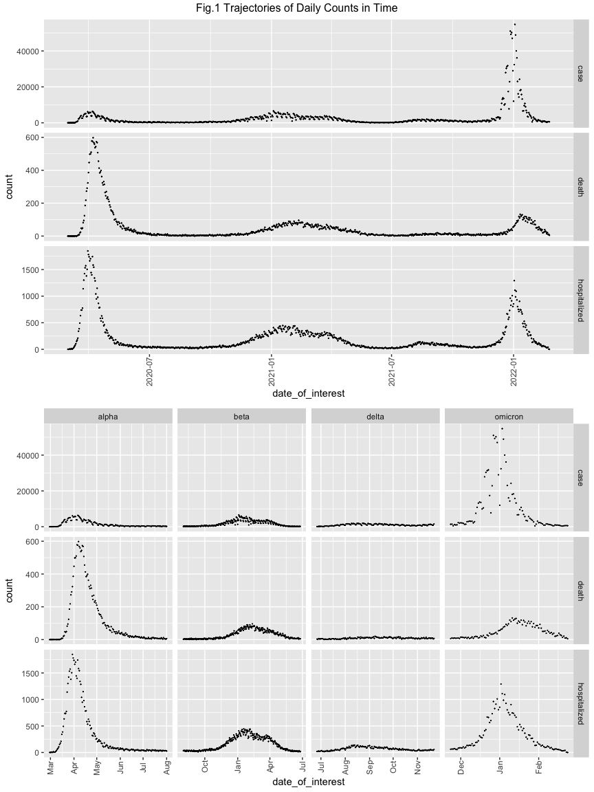
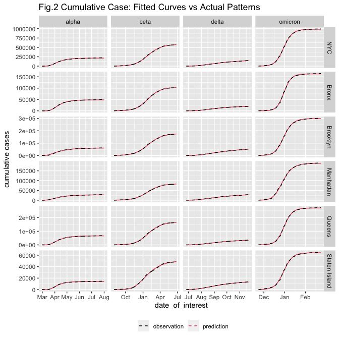
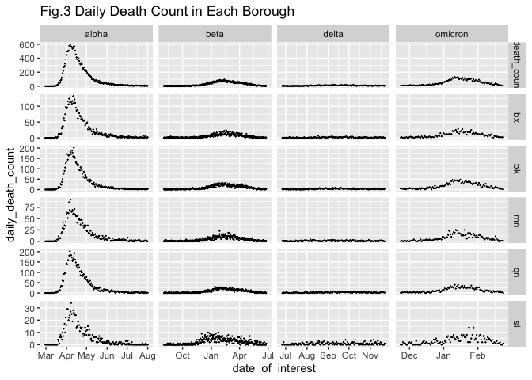
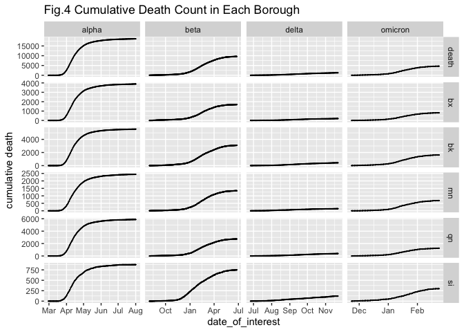
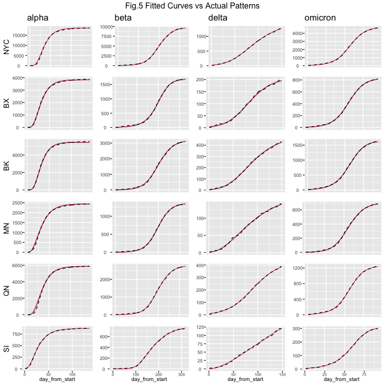
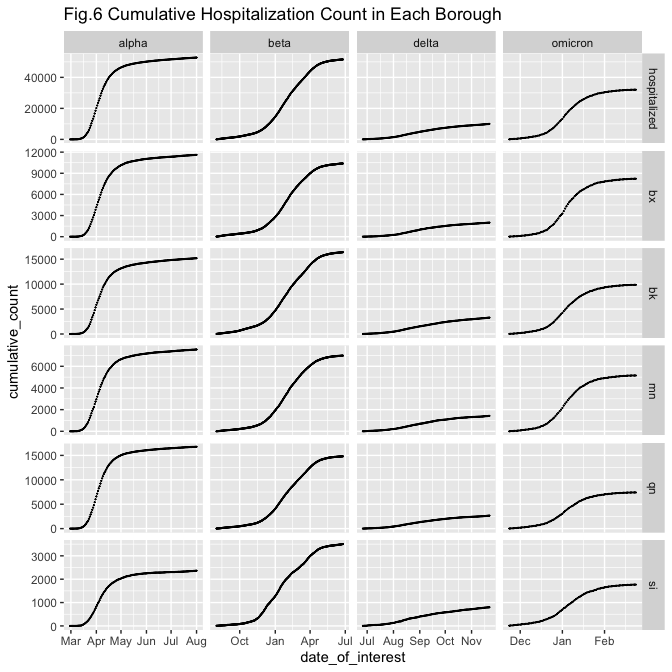

Analysis of Cumulative COVID-19 Cases,Hospitalizations, and Deaths in
NYC
================
04/01/2022

*Xiao Ma(xm2276), Yida Wang(yw3774), Ruiqi Yan(ry2417), Hao
Zheng(hz2770), Peilin Zhou(pz2281)*

## Introduction

***Objectives*** The rapid spreading of COVID-19 has been a serious
threat to global health, economic, and the social systems for the last
two years and its impact is still ongoing. Studying the current status
and using a model to mimic the growth of confirmed cases, deaths, and
hospitalizations of COVID-19 are unquestionably necessary for predicting
the future dynamics of this virus and planning for strategic responses.
This project focuses on the cumulative confirmed COVID-19 cases, deaths,
and hospitalization counts in each borough of New York City since
February 29th, 2020, which is the date of the start of outbreak in NYC.
The objectives of the project include applying the widely-used Richard
growth function to model the cumulative counts as different pandemic
waves for each borough. To obtain estimates of the parameters of the
growth function that capture the real patterns, an optimization
algorithm based on Newton-Raphson is developed. Then, a comparison is
made between the fitted curves of each pandemic wave and borough and the
observations based on the data.

***Data Description*** Data used for this project is obtained from NYC
open data. It contains the daily counts of confirmed COVID-19 cases,
deaths, and hospitalizations in Bronx, Brooklyn, Manhattan, Queens, and
Staten Island from February 29th, 2020 to February 24th 2022. For the
purpose of this project, the cumulative counts are calculated by summing
up the daily observations. 4 pandemic waves are identified by plotting
the daily counts by day as a direct indication as shown in Fig 1. A
clear pattern of the trajectory in time is observed. The cutting point
of each wave is inferred by the declination of each wave. The name of
each wave is given based on the variant detected at that approximate
time period. Therefore, 4 pandemic waves are named as alpha, beta,
delta, and omicron. Alpha wave starts from February 29th, 2020 to August
1st, 2020; beta wave starts from August 2nd 2020 to June 25th, 2021;
delta wave starts from June 26th, 2021 to November 21st, 2021; omicron
wave starts from November 22nd, 2021 to the latest date in the data,
February 24th, 2022.

## Model and Optimization Algorithms

***Richard Growth Function*** The Richard Growth Curve Model, also known
as the generalized logistic curve, is a four-parameter, nonlinear
S-shaped function and its utility is the ability to describe a variety
of growing processes. Let N(t) be a population at time t, the function
takes the form
$N(t) = \\frac{a}{\\{ 1+ d\\exp\\{-k(t-t\_0)\\}\\}^{1/d}}.$ The four
parameters in the model include a, k, d, and t0. In epidemiological
modeling, the Richard curve can be understood as describing the
infection trajectories in time. In terms of modeling the outbreak of
COVID-19, N(t) represents the cumulative counts of cases at time t; t
represents the time since infection takes place; a is the maximum N(t)
it can reach (the maximum cumulative counts across time); d is a shape
parameter which controls the flexibility of the curve; k is the slope of
inflection, in other words, the infection rate; t0 is the time at an
inflection where the curve changes from convex to concave.

***Newton-Raphson*** is a multivariate generalization of Newton’s
method, which focuses on improving a function of one variable
interactively. First, set initial point **θ**<sub>0</sub>, evaluate the
approximated gradient  ▽ *f*(*θ*) using
 ▽ *f*(**θ**<sub>0</sub>) + ▽<sup>2</sup>*f*(**θ**<sub>0</sub>)(**θ** − **θ**<sub>0</sub>)
Next by setting this equation to 0, we can solve the solution as the
next point. Then iterate until convergence for the sequence of *θ* is
achieved. The ith **θ** is
**θ**<sub>*i*</sub> = **θ**<sub>*i* − 1</sub> − \[▽<sup>2</sup>*f*(**θ**<sub>*i* − 1</sub>)\]<sup> − 1</sup> ▽ *f*(**θ**<sub>*i* − 1</sub>)
Then, we modified Newton-Raphson by including a step-halving method and
redirection. Step-halving is to cut the potential step (*λ*) in half
until non-decreasing log-likelihood is reached in each iteration;
Redirection is to check the Hessian matrix is negative definite at each
step, if not, replace it with a similar negative definite matrix such as
▽<sup>2</sup>*f*(**θ**<sub>*i* − 1</sub>) − *γ**I*, with *γ* being
sufficiently large to generate negative definite matrix.  

***Broyden-Fletcher-Goldfarb-Shanno Method*** Sometime it is frustrating
to solve inverse of the matrix hessian matrix in high dimension Newton
Raphson, so the method BFGS(Broyden-Fletcher-Goldfarb-Shanno Method) is
introduced to approximate
▽<sup>2</sup>*f*(**θ**<sub>*i*</sub>)<sup> − 1</sup>. That is to update
the surrogate *B*<sub>*i*</sub> through the formula
$B\_i = (I - \\frac{S\_{i-1}Y\_{i-1}^\\intercal}{Y\_{i-1}^\\intercal S\_{i-1}})B\_{i-1}(I - \\frac{Y\_{i-1}S\_{i-1}^\\intercal}{Y\_{i-1}^\\intercal S\_{i-1}}) + \\frac{S\_{i-1}S\_{i-1}^\\intercal}{Y\_{i-1}^\\intercal S\_{i-1}}$
at each ith iteration, where
*S*<sub>*i*</sub> = **θ**<sub>*i*</sub> − **θ**<sub>*i* − 1</sub>,
*Y*<sub>*i*</sub> =  ▽ *f*(**θ**<sub>*i*</sub>) −  ▽ *f*(**θ**<sub>*i* − 1</sub>).  

***Assumptions*** In order to apply optimization algorithm to fit the
cumulative confirmed cases, hospitalization and death of Covid-19 with
Richard growth model, we assume that the cumulative count
*Y*<sub>*i*</sub> of each wave is normally distributed with mean,
*N*(**θ**; *t*<sub>*i*</sub>), and variance, *σ*<sup>2</sup>. While
*N*(**θ**; *t*<sub>*i*</sub>) is the Richard growth model in day
*t*<sub>*i*</sub> with parameter
**θ** = (*a*, *k*, *d*, *t*<sub>0</sub>), *θ* is fixed within each wave
and differs across waves. *t*<sub>*i*</sub> is the number of days from
the beginning of each pandemic wave.  

Given the normality assumption and the observed cumulative count
*Y*<sub>*i*</sub>, the log-likelihood function with respect to **θ** is
$-\\frac{\\sum\_{i=1}^n(Y\_i-N(\\boldsymbol\\theta;t\_i))^2}{2\\sigma^2}-n\\log\\left(\\sqrt{2\\pi\\sigma^2}\\right)$
Assuming *σ*<sup>2</sup> is known and constant, **θ** are independent of
*σ*<sup>2</sup>. Then, *σ*<sup>2</sup> could be ignored and **θ** that
maximizes the likelihood function is equivalent to the one maximizing
$-\\sum\_{i=1}^n\\left(Y\_i-N(\\boldsymbol\\theta,t\_i)\\right)^2$.

***Initial Value*** Before the optimization algorithm is implemented, it
is necessary to have a good guess of the parameters that are close to
the true values to initiate the iteration, an improper starting value
could result in non-convergence, slow-convergence or wrong convergence.
According to the geometric meanings and the mathematical relationship in
the growth model, we develop a strategy, which utilizes observations to
make the reasonable guess of *a*, *k*, *d* and *t*<sub>0</sub>.

-   The guess of *a* is the maximum of *Y*<sub>*i*</sub>, since it
    stands for the upper bound of *N*(**θ**, *t*<sub>*i*</sub>).
    *t*<sub>0</sub> is the day in inflection, so the growth is fastest
    and the number of daily cases is highest in *t*<sub>0</sub> day. The
    initial value of *t*<sub>0</sub> should be the day that has maximum
    daily cases.

-   When *t*<sub>*i*</sub> = *t*<sub>0</sub>,  
    $N(t\_0) = \\frac{a}{(1+d)^{1/d}} \\Rightarrow 1+d - \\left(\\frac{a}{N(t\_0)}\\right)^d = 0$
    The most reasonable estimation of *N*(*t*<sub>0</sub>) is cumulative
    count on *t*<sub>0</sub>, *Y*<sub>0</sub>. Then, we apply the
    bi-section algorithm with the initial guess of *a* and
    *t*<sub>0</sub> to find the root of
    $1+d - \\left(\\frac{a}{Y\_0}\\right)^d$ as the initial *d*. Since
    *d* is commonly between 0 and 1 but cannot be 0, the default
    starting interval of bi-section algorithm is 0.1 and 1. If the
    function in lower and upper bound have the same sign, the algorithm
    returns the lower bound; if the default interval could not produce
    the good guess of *d* and cause the non-convergence in iterations,
    different intervals could be used to find a better guess for *d*.

-   As *a*, *t*<sub>0</sub> and *d* are known, the growth model could be
    transformed into a linear model:
    $\\log\\left(\\frac{\\left(\\frac{a}{N(t\_i)}\\right)^d-1}{d}\\right) = -kt\_i+kt\_0$
    The slope of this model is  − *k*. After replacing
    *N*(*t*<sub>*i*</sub>) with observed *Y*<sub>*i*</sub> and fitting a
    linear regression between *t*<sub>*i*</sub> and the logarithm on the
    left, the opposite of the slope is our initial guess of *k*. Only
    observed *Y*<sub>*i*</sub> smaller than initial *a* is used,
    otherwise, the logarithm will be undefined.

***Implementation*** The optimization is only implemented on the nonzero
cumulative observations. The modified Newton-Raphson algorithm in the
dimension of 4 is utilized. Moreover, a matrix *B*<sub>*i*</sub>
calculated by the BFGS method surrogates the inverse of the Hessian
matrix to avoid the computational burden of solving inverse and improve
the efficiency. For convenience, the negative identity matrix is the
initial surrogate matrix.  
In each iteration, the algorithm checks whether the surrogate matrix is
negative definite and performs redirection if not. Then, we apply
newton-raphson with step-halving to ensure that log-likelihood is
non-decreasing with updated **θ**<sub>*i* + 1</sub>. Lastly, the
surrogate matrix is updated through the BFGS formula before the next
iteration.

## Results

***Confirmed Case*** By observing the comparison plot (Fig 2) between
the fitted curve and the actual cases, the predicted curves are pretty
good. The predicted curve and the cumulated confirmed cases curve are
almost overlapping. Alpha, beta and delta have relatively flattened
cumulative case curves, Beta and omicron have a better “S-shape.” Beta
and Omicron have rapidly increased in cumulative cases. One of the
reasons is the weather, winter facilitates the virus to spread. More
importantly, omicron moves fast, it spreads swiftly through populations,
and infections develop quickly in individuals. Although delta has
shorter incubation on average, most of the public are well-prepared.
People wear masks and some of them already get the vaccine.

Between boroughs we find that each borough shares similar trends of
cumulative cases. In alpha, Bronx has the highest cumulative cases. In
beta, delta and omicron, Brooklyn has the highest cumulative cases.

From the estimate parameters table (Table 1), as mentioned above, *a* is
the largest population could reach. *k* is the growth rate. *d* is the
shape parameter and *t*<sub>0</sub> is the time at incubation. Among
four waves, omicron has the largest upper bound of people who could be
infected and the largest growth rate. The growth rate of the delta and
omicron are very close. Regardless of boroughs, the alpha wave has the
smallest inflection point so it reached the peak of daily counts
earliest; the inflection of the beta wave came the latest. Among
boroughs in alpha, although Staten Island has the lowest upper bound of
confirmed cases, it has the highest growth rate. In the beta, delta, and
omicron wave, Bronx has the highest growth rate; Brooklyn has lowest
growth rate in alpha and delta, Staten Island has lowest growth rate in
beta and Manhattan has lowest growth rate in omicron. Brooklyn always
has the highest upper bond since it has the largest population among
boroughs (The Bronx 1,472,654; Brooklyn 2,736,074; Manhattan 1,694,251;
Queens 2,405,464; Staten Island 495,747 according to census 2020).

***Deaths*** For the cumulative deaths, we can see from the daily death
count (Fig 3) that the variant alpha caused more deaths than the other 3
variants, and Brooklyn and Queen have more deaths than the other
boroughs. For the cumulative death count (Fig 4), the variant alpha has
a clear S-shape, meaning it has a steeper peak than the other three. On
the contrary, you can merely see the s-shape for delta. For the same
wave, borough Bronx, Brooklyn and Queens have higher cumulative death
counts. For the same variant, the waves seem to be quite similar across
different boroughs.

The fitted fatality curves of each pandemic wave and borough (red lines)
based on the estimated parameters of the Richard’s function show good
agreement with the actual patterns as illustrated in Fig 5. As each
pandemic wave has leveled off, the fitted fatality curve is
well-adjusted correspondingly. From the plots, it is also observed that
the inflection point where the curve changes from convex to concave
comes rather quickly for the alpha wave comparatively, meaning that the
growth rate of death comes to decay in this wave.

Estimates of the parameters in Richard’s function for cumulative death
counts are listed in table 2. The growth rate of death, k, is higher in
the Bronx in the first three waves. This might be due to the
insufficient access to health care facilities. Also, the growth rate is
highest in the last wave across boroughs. The inflection is estimated to
happen more rapidly in the alpha wave and relatively slower in the beta
wave since the value of t0 indicates the inflection point. The counts of
death are uncomparable across boroughs because of the varied population
size. However, by alternating the count to rate, it is possible to draw
some insights from comparison. The estimated maximum case fatality rate
is calculated by the estimated value of maximum death counts over the
maximum confirmed case counts, which is the parameter *a* in the Richard
curve. As shown in Table 3, the omicron wave is estimated to have a
relatively lowest case fatality rate and Manhattan has the lowest value
among the boroughs during the omicron wave. The estimates are highest
for the alpha wave and this is reasonable since it is the beginning of
the outbreak when the severity of the virus is unaware of and the
necessary medical supports are inadequate. In contrast, as the variant
changes to omicron, a significant decrease is observed across boroughs.

***Hospitalization*** In this part, we divided the date into 4
curves(alpha, beta, delta, omicron) using the same date points in the
death and case part. According to the daily hospitalized count plot(Fig
1), we can observe that the alpha and delta have the highest number of
hospitalizations which is more than 50000, while delta has the lowest
number of that,only 10000. Although the omicron has the second lowest
peak in total number, it grows very sharply. The daily hospitalized
counts are also divided into each borough(Fig 6). From the panel plots,
it’s clear to see that the curves look very similar across each borough.

The detailed parameter estimates table for hospitalized cases are shown
in Table 4. k indicates the increase rate of hospitalized cases, a is
the peak for the number of hospitalized cases and *t*<sub>0</sub> is the
inflection point of the curves. As the table showed, the omicron period
has the highest increase rate instead of the alpha period. Although the
beta and delta periods’ waves seem differently in the figure, they have
similar increase rates (k values). Staten Island has the lowest increase
rate except in alpha, in which wave Brooklyn has the lowest increase
rate while Bronx always has the largest or the second largest increase
rate. Brooklyn has the largest or the second largest peak in all four
periods. Staten Island is the first one to reach infection point in the
delta period, which means it has the shortest time to have the largest
number of cases. Comparing between the waves, we can find that the alpha
reaches the inflection point very fast while the beta has the longest
days to reach the peak.

Similar to what has been done in analyzing the death cases, the case
hospitalization rate is calculated using the same formula in case
fatality rate. We can get the new table of adjusted a (table 5) which
indicates the proportion of people hospitalized among those who got
covid-19. We can observe that the rate of hospitalization has a
decreasing trend from alpha wave to omicron wave and the omicron wave is
almost 0.1 times of the rate of alpha wave. Bronx has the highest case
hospitalization rate in the omicron period (0.0500) among all the
boroughs, while NYC only for 0.0323 at the same time. In the alpha wave,
Manhattan draw the highest case hospitalization rate (0.2681).
Meanwhile, Staten Island only for 0.1625.

Based on the fit graphs (Fig 7), we can see our model fits well, even
though there is a very slight difference between the real one in
Brooklyn during the alpha period.

## Conclusion

***Findings*** In conclusion, the four waves behave quite differently
and represent the four different variants for COVID-19: alpha, beta,
delta and omicron. We use the modified Newton-Raphson algorithm with
step-halving, redirection and BFGS method to fit different curves for
different boroughs. For confirmed cases, alpha have a longer incubation
period while omicron has a high peak and a sharply increase; For
hospitalization, alpha, beta both have a high peak, omicron have a low
peak but a sharply increase; For deaths, inflection happens more quickly
for the alpha wave across boroughs and the beta wave has longer lag
phase relatively. The growth rate of death counts is highest in the last
wave but its maximum case fatality rate is the lowest across boroughs
and other waves. In general, the modified Newton-Raphson algorithm
performs reasonably well in fitting the COVID-19 data with the Richard
growth model.  

***Limitation*** One disadvantage of the algorithm is that it is very
sensitive to the selection of starting values, especially the shape
parameter d. We could make reasonable and close guesses of a, k and
*t*<sub>0</sub>, but for the initial guess of d, a slight deviation from
the true value could easily result in a long execution time or
non-convergence. In the future, we might need to modify our strategy
about guessing the shape parameter, d. In addition, our parameter
estimation is limited to our current data of COVID-19 as as in-sample
analysis. It is implemented to help us understand the mathematical
framework of Richard Curve and its application in epidemiological
modeling, but the model may not be predictive of further epidemic change
in COVID-19 as the out-sample validation is not performed for this
model.  

## Contribution:

Xiao Ma responsible for confirmed cases comparison and the corresponding
part for PPT and report. Yida Wang finished the data of the
hospitalization part including code, PPT and report. Ruiqi Yan developed
the strategy of initial guess and implementation of optimization
algorithms in code, report and presentation, fitted the confirmed cases
using the algorithm and generated the table and figure for confirmed
cases part. Hao Zheng fitted the curves for the cumulative death count
of Bronx, Brooklyn and Manhattan, explaining the algorithms used,
generalized description of death curve and conclusion. Peilin Zhou was
responsible for fitting fatality curves for Queens and Staten Island,
generating comparison plots and estimate table for the cumulative death
counts, and writing introduction, richard’s curve, and the result of
comparison in the death section of the report.

# Appendix I Figures and Tables

<!-- -->

<!-- -->
<table>
<caption>
Estimates of Parameters for Cumulative Case
</caption>
<thead>
<tr>
<th style="empty-cells: hide;border-bottom:hidden;" colspan="1">
</th>
<th style="border-bottom:hidden;padding-bottom:0; padding-left:3px;padding-right:3px;text-align: center; font-weight: bold; " colspan="4">

<div style="border-bottom: 1px solid #ddd; padding-bottom: 5px; ">

alpha

</div>

</th>
<th style="border-bottom:hidden;padding-bottom:0; padding-left:3px;padding-right:3px;text-align: center; font-weight: bold; " colspan="4">

<div style="border-bottom: 1px solid #ddd; padding-bottom: 5px; ">

beta

</div>

</th>
<th style="border-bottom:hidden;padding-bottom:0; padding-left:3px;padding-right:3px;text-align: center; font-weight: bold; " colspan="4">

<div style="border-bottom: 1px solid #ddd; padding-bottom: 5px; ">

delta

</div>

</th>
<th style="border-bottom:hidden;padding-bottom:0; padding-left:3px;padding-right:3px;text-align: center; font-weight: bold; " colspan="4">

<div style="border-bottom: 1px solid #ddd; padding-bottom: 5px; ">

omicron

</div>

</th>
</tr>
<tr>
<th style="text-align:center;font-weight: bold;">
Borough
</th>
<th style="text-align:center;font-weight: bold;">
a
</th>
<th style="text-align:center;font-weight: bold;">
k
</th>
<th style="text-align:center;font-weight: bold;">
d
</th>
<th style="text-align:center;font-weight: bold;">
t0
</th>
<th style="text-align:center;font-weight: bold;">
a
</th>
<th style="text-align:center;font-weight: bold;">
k
</th>
<th style="text-align:center;font-weight: bold;">
d
</th>
<th style="text-align:center;font-weight: bold;">
t0
</th>
<th style="text-align:center;font-weight: bold;">
a
</th>
<th style="text-align:center;font-weight: bold;">
k
</th>
<th style="text-align:center;font-weight: bold;">
d
</th>
<th style="text-align:center;font-weight: bold;">
t0
</th>
<th style="text-align:center;font-weight: bold;">
a
</th>
<th style="text-align:center;font-weight: bold;">
k
</th>
<th style="text-align:center;font-weight: bold;">
d
</th>
<th style="text-align:center;font-weight: bold;">
t0
</th>
</tr>
</thead>
<tbody>
<tr>
<td style="text-align:center;font-weight: bold;color: black !important;border-right:1px solid;">
NYC
</td>
<td style="text-align:center;">
214896
</td>
<td style="text-align:center;">
0.056
</td>
<td style="text-align:center;">
-0.168
</td>
<td style="text-align:center;">
33
</td>
<td style="text-align:center;">
584029
</td>
<td style="text-align:center;">
0.026
</td>
<td style="text-align:center;">
0.732
</td>
<td style="text-align:center;">
176
</td>
<td style="text-align:center;">
173483
</td>
<td style="text-align:center;">
0.019
</td>
<td style="text-align:center;">
-0.335
</td>
<td style="text-align:center;">
57
</td>
<td style="text-align:center;">
985059
</td>
<td style="text-align:center;">
0.145
</td>
<td style="text-align:center;">
0.791
</td>
<td style="text-align:center;">
38
</td>
</tr>
<tr>
<td style="text-align:center;font-weight: bold;color: black !important;border-right:1px solid;">
Bronx
</td>
<td style="text-align:center;">
48438
</td>
<td style="text-align:center;">
0.060
</td>
<td style="text-align:center;">
-0.19
</td>
<td style="text-align:center;">
29
</td>
<td style="text-align:center;">
103621
</td>
<td style="text-align:center;">
0.030
</td>
<td style="text-align:center;">
0.884
</td>
<td style="text-align:center;">
178
</td>
<td style="text-align:center;">
21088
</td>
<td style="text-align:center;">
0.027
</td>
<td style="text-align:center;">
-0.188
</td>
<td style="text-align:center;">
56
</td>
<td style="text-align:center;">
162944
</td>
<td style="text-align:center;">
0.173
</td>
<td style="text-align:center;">
0.798
</td>
<td style="text-align:center;">
39
</td>
</tr>
<tr>
<td style="text-align:center;font-weight: bold;color: black !important;border-right:1px solid;">
Brooklyn
</td>
<td style="text-align:center;">
60578
</td>
<td style="text-align:center;">
0.039
</td>
<td style="text-align:center;">
-0.404
</td>
<td style="text-align:center;">
24
</td>
<td style="text-align:center;">
177569
</td>
<td style="text-align:center;">
0.026
</td>
<td style="text-align:center;">
0.848
</td>
<td style="text-align:center;">
179
</td>
<td style="text-align:center;">
65847
</td>
<td style="text-align:center;">
0.017
</td>
<td style="text-align:center;">
-0.361
</td>
<td style="text-align:center;">
62
</td>
<td style="text-align:center;">
298991
</td>
<td style="text-align:center;">
0.135
</td>
<td style="text-align:center;">
0.701
</td>
<td style="text-align:center;">
38
</td>
</tr>
<tr>
<td style="text-align:center;font-weight: bold;color: black !important;border-right:1px solid;">
Manhattan
</td>
<td style="text-align:center;">
27379
</td>
<td style="text-align:center;">
0.043
</td>
<td style="text-align:center;">
-0.278
</td>
<td style="text-align:center;">
31
</td>
<td style="text-align:center;">
83873
</td>
<td style="text-align:center;">
0.027
</td>
<td style="text-align:center;">
0.861
</td>
<td style="text-align:center;">
176
</td>
<td style="text-align:center;">
32659
</td>
<td style="text-align:center;">
0.019
</td>
<td style="text-align:center;">
-0.352
</td>
<td style="text-align:center;">
56
</td>
<td style="text-align:center;">
188762
</td>
<td style="text-align:center;">
0.115
</td>
<td style="text-align:center;">
0.496
</td>
<td style="text-align:center;">
35
</td>
</tr>
<tr>
<td style="text-align:center;font-weight: bold;color: black !important;border-right:1px solid;">
Queens
</td>
<td style="text-align:center;">
66060
</td>
<td style="text-align:center;">
0.056
</td>
<td style="text-align:center;">
-0.188
</td>
<td style="text-align:center;">
31
</td>
<td style="text-align:center;">
168444
</td>
<td style="text-align:center;">
0.026
</td>
<td style="text-align:center;">
0.629
</td>
<td style="text-align:center;">
176
</td>
<td style="text-align:center;">
39717
</td>
<td style="text-align:center;">
0.021
</td>
<td style="text-align:center;">
-0.32
</td>
<td style="text-align:center;">
56
</td>
<td style="text-align:center;">
270766
</td>
<td style="text-align:center;">
0.155
</td>
<td style="text-align:center;">
0.831
</td>
<td style="text-align:center;">
39
</td>
</tr>
<tr>
<td style="text-align:center;font-weight: bold;color: black !important;border-right:1px solid;">
Staten Island
</td>
<td style="text-align:center;">
14119
</td>
<td style="text-align:center;">
0.066
</td>
<td style="text-align:center;">
-0.192
</td>
<td style="text-align:center;">
26
</td>
<td style="text-align:center;">
50936
</td>
<td style="text-align:center;">
0.019
</td>
<td style="text-align:center;">
0.117
</td>
<td style="text-align:center;">
158
</td>
<td style="text-align:center;">
15265
</td>
<td style="text-align:center;">
0.021
</td>
<td style="text-align:center;">
-0.26
</td>
<td style="text-align:center;">
57
</td>
<td style="text-align:center;">
64203
</td>
<td style="text-align:center;">
0.151
</td>
<td style="text-align:center;">
0.942
</td>
<td style="text-align:center;">
39
</td>
</tr>
</tbody>
</table>

<!-- --><!-- -->

<!-- -->

<table>
<caption>
Estimates of Parameters for Cumulative Death Counts
</caption>
<thead>
<tr>
<th style="empty-cells: hide;border-bottom:hidden;" colspan="1">
</th>
<th style="border-bottom:hidden;padding-bottom:0; padding-left:3px;padding-right:3px;text-align: center; font-weight: bold; " colspan="4">

<div style="border-bottom: 1px solid #ddd; padding-bottom: 5px; ">

alpha

</div>

</th>
<th style="border-bottom:hidden;padding-bottom:0; padding-left:3px;padding-right:3px;text-align: center; font-weight: bold; " colspan="4">

<div style="border-bottom: 1px solid #ddd; padding-bottom: 5px; ">

beta

</div>

</th>
<th style="border-bottom:hidden;padding-bottom:0; padding-left:3px;padding-right:3px;text-align: center; font-weight: bold; " colspan="4">

<div style="border-bottom: 1px solid #ddd; padding-bottom: 5px; ">

delta

</div>

</th>
<th style="border-bottom:hidden;padding-bottom:0; padding-left:3px;padding-right:3px;text-align: center; font-weight: bold; " colspan="4">

<div style="border-bottom: 1px solid #ddd; padding-bottom: 5px; ">

omicron

</div>

</th>
</tr>
<tr>
<th style="text-align:center;font-weight: bold;">
Borough
</th>
<th style="text-align:center;font-weight: bold;">
a
</th>
<th style="text-align:center;font-weight: bold;">
k
</th>
<th style="text-align:center;font-weight: bold;">
d
</th>
<th style="text-align:center;font-weight: bold;">
t0
</th>
<th style="text-align:center;font-weight: bold;">
a
</th>
<th style="text-align:center;font-weight: bold;">
k
</th>
<th style="text-align:center;font-weight: bold;">
d
</th>
<th style="text-align:center;font-weight: bold;">
t0
</th>
<th style="text-align:center;font-weight: bold;">
a
</th>
<th style="text-align:center;font-weight: bold;">
k
</th>
<th style="text-align:center;font-weight: bold;">
d
</th>
<th style="text-align:center;font-weight: bold;">
t0
</th>
<th style="text-align:center;font-weight: bold;">
a
</th>
<th style="text-align:center;font-weight: bold;">
k
</th>
<th style="text-align:center;font-weight: bold;">
d
</th>
<th style="text-align:center;font-weight: bold;">
t0
</th>
</tr>
</thead>
<tbody>
<tr>
<td style="text-align:center;font-weight: bold;color: black !important;border-right:1px solid;">
NYC
</td>
<td style="text-align:center;">
18621
</td>
<td style="text-align:center;">
0.064
</td>
<td style="text-align:center;">
-0.1807
</td>
<td style="text-align:center;">
28
</td>
<td style="text-align:center;">
9828
</td>
<td style="text-align:center;">
0.030
</td>
<td style="text-align:center;">
0.90261
</td>
<td style="text-align:center;">
198
</td>
<td style="text-align:center;">
1492
</td>
<td style="text-align:center;">
0.026
</td>
<td style="text-align:center;">
0.2317
</td>
<td style="text-align:center;">
80
</td>
<td style="text-align:center;">
4753
</td>
<td style="text-align:center;">
0.103
</td>
<td style="text-align:center;">
1.1999
</td>
<td style="text-align:center;">
57
</td>
</tr>
<tr>
<td style="text-align:center;font-weight: bold;color: black !important;border-right:1px solid;">
Bronx
</td>
<td style="text-align:center;">
3822
</td>
<td style="text-align:center;">
0.069
</td>
<td style="text-align:center;">
-0.1956
</td>
<td style="text-align:center;">
24
</td>
<td style="text-align:center;">
1694
</td>
<td style="text-align:center;">
0.040
</td>
<td style="text-align:center;">
1.59619
</td>
<td style="text-align:center;">
204
</td>
<td style="text-align:center;">
209
</td>
<td style="text-align:center;">
0.038
</td>
<td style="text-align:center;">
0.6073
</td>
<td style="text-align:center;">
77
</td>
<td style="text-align:center;">
830
</td>
<td style="text-align:center;">
0.103
</td>
<td style="text-align:center;">
1.1574
</td>
<td style="text-align:center;">
57
</td>
</tr>
<tr>
<td style="text-align:center;font-weight: bold;color: black !important;border-right:1px solid;">
Brooklyn
</td>
<td style="text-align:center;">
5473
</td>
<td style="text-align:center;">
0.075
</td>
<td style="text-align:center;">
-0.1621
</td>
<td style="text-align:center;">
25
</td>
<td style="text-align:center;">
3187
</td>
<td style="text-align:center;">
0.028
</td>
<td style="text-align:center;">
0.84765
</td>
<td style="text-align:center;">
199
</td>
<td style="text-align:center;">
488
</td>
<td style="text-align:center;">
0.027
</td>
<td style="text-align:center;">
0.1885
</td>
<td style="text-align:center;">
78
</td>
<td style="text-align:center;">
1650
</td>
<td style="text-align:center;">
0.106
</td>
<td style="text-align:center;">
1.3198
</td>
<td style="text-align:center;">
57
</td>
</tr>
<tr>
<td style="text-align:center;font-weight: bold;color: black !important;border-right:1px solid;">
Manhattan
</td>
<td style="text-align:center;">
2438
</td>
<td style="text-align:center;">
0.057
</td>
<td style="text-align:center;">
-0.2906
</td>
<td style="text-align:center;">
23
</td>
<td style="text-align:center;">
1358
</td>
<td style="text-align:center;">
0.034
</td>
<td style="text-align:center;">
1.05481
</td>
<td style="text-align:center;">
198
</td>
<td style="text-align:center;">
171
</td>
<td style="text-align:center;">
0.019
</td>
<td style="text-align:center;">
-0.2214
</td>
<td style="text-align:center;">
62
</td>
<td style="text-align:center;">
704
</td>
<td style="text-align:center;">
0.091
</td>
<td style="text-align:center;">
0.7591
</td>
<td style="text-align:center;">
55
</td>
</tr>
<tr>
<td style="text-align:center;font-weight: bold;color: black !important;border-right:1px solid;">
Queens
</td>
<td style="text-align:center;">
5877
</td>
<td style="text-align:center;">
0.060
</td>
<td style="text-align:center;">
-0.2125
</td>
<td style="text-align:center;">
27
</td>
<td style="text-align:center;">
2810
</td>
<td style="text-align:center;">
0.029
</td>
<td style="text-align:center;">
0.72999
</td>
<td style="text-align:center;">
195
</td>
<td style="text-align:center;">
436
</td>
<td style="text-align:center;">
0.033
</td>
<td style="text-align:center;">
0.6833
</td>
<td style="text-align:center;">
88
</td>
<td style="text-align:center;">
1255
</td>
<td style="text-align:center;">
0.108
</td>
<td style="text-align:center;">
1.2788
</td>
<td style="text-align:center;">
57
</td>
</tr>
<tr>
<td style="text-align:center;font-weight: bold;color: black !important;border-right:1px solid;">
Staten\_Island
</td>
<td style="text-align:center;">
871
</td>
<td style="text-align:center;">
0.058
</td>
<td style="text-align:center;">
-0.3659
</td>
<td style="text-align:center;">
18
</td>
<td style="text-align:center;">
794
</td>
<td style="text-align:center;">
0.018
</td>
<td style="text-align:center;">
-0.06518
</td>
<td style="text-align:center;">
151
</td>
<td style="text-align:center;">
284
</td>
<td style="text-align:center;">
0.007
</td>
<td style="text-align:center;">
-0.5393
</td>
<td style="text-align:center;">
92
</td>
<td style="text-align:center;">
312
</td>
<td style="text-align:center;">
0.109
</td>
<td style="text-align:center;">
1.7555
</td>
<td style="text-align:center;">
61
</td>
</tr>
</tbody>
</table>
<table class=" lightable-paper" style="font-family: &quot;Arial Narrow&quot;, arial, helvetica, sans-serif; margin-left: auto; margin-right: auto;">
<caption>
Maximum Case Fatality Rate
</caption>
<thead>
<tr>
<th style="empty-cells: hide;" colspan="1">
</th>
<th style="padding-bottom:0; padding-left:3px;padding-right:3px;text-align: center; " colspan="4">

<div style="border-bottom: 1px solid #00000020; padding-bottom: 5px; ">

Case Fatality Rate

</div>

</th>
</tr>
<tr>
<th style="text-align:left;">
Borough
</th>
<th style="text-align:right;">
alpha
</th>
<th style="text-align:right;">
beta
</th>
<th style="text-align:right;">
delta
</th>
<th style="text-align:right;">
omicron
</th>
</tr>
</thead>
<tbody>
<tr>
<td style="text-align:left;">
Bronx
</td>
<td style="text-align:right;">
0.0789
</td>
<td style="text-align:right;">
0.0163
</td>
<td style="text-align:right;">
0.0099
</td>
<td style="text-align:right;">
0.0051
</td>
</tr>
<tr>
<td style="text-align:left;">
Brooklyn
</td>
<td style="text-align:right;">
0.0903
</td>
<td style="text-align:right;">
0.0179
</td>
<td style="text-align:right;">
0.0074
</td>
<td style="text-align:right;">
0.0055
</td>
</tr>
<tr>
<td style="text-align:left;">
Manhattan
</td>
<td style="text-align:right;">
0.0890
</td>
<td style="text-align:right;">
0.0162
</td>
<td style="text-align:right;">
0.0052
</td>
<td style="text-align:right;">
0.0037
</td>
</tr>
<tr>
<td style="text-align:left;">
Queens
</td>
<td style="text-align:right;">
0.0890
</td>
<td style="text-align:right;">
0.0167
</td>
<td style="text-align:right;">
0.0110
</td>
<td style="text-align:right;">
0.0046
</td>
</tr>
<tr>
<td style="text-align:left;">
Staten Island
</td>
<td style="text-align:right;">
0.0617
</td>
<td style="text-align:right;">
0.0156
</td>
<td style="text-align:right;">
0.0186
</td>
<td style="text-align:right;">
0.0049
</td>
</tr>
</tbody>
</table>

<!-- -->

<!-- -->
<table>
<caption>
Estimates of Parameters for Cumulative Hospitalization
</caption>
<thead>
<tr>
<th style="empty-cells: hide;border-bottom:hidden;" colspan="1">
</th>
<th style="border-bottom:hidden;padding-bottom:0; padding-left:3px;padding-right:3px;text-align: center; font-weight: bold; " colspan="4">

<div style="border-bottom: 1px solid #ddd; padding-bottom: 5px; ">

alpha

</div>

</th>
<th style="border-bottom:hidden;padding-bottom:0; padding-left:3px;padding-right:3px;text-align: center; font-weight: bold; " colspan="4">

<div style="border-bottom: 1px solid #ddd; padding-bottom: 5px; ">

beta

</div>

</th>
<th style="border-bottom:hidden;padding-bottom:0; padding-left:3px;padding-right:3px;text-align: center; font-weight: bold; " colspan="4">

<div style="border-bottom: 1px solid #ddd; padding-bottom: 5px; ">

delta

</div>

</th>
<th style="border-bottom:hidden;padding-bottom:0; padding-left:3px;padding-right:3px;text-align: center; font-weight: bold; " colspan="4">

<div style="border-bottom: 1px solid #ddd; padding-bottom: 5px; ">

omicron

</div>

</th>
</tr>
<tr>
<th style="text-align:center;font-weight: bold;">
Borough
</th>
<th style="text-align:center;font-weight: bold;">
a
</th>
<th style="text-align:center;font-weight: bold;">
k
</th>
<th style="text-align:center;font-weight: bold;">
d
</th>
<th style="text-align:center;font-weight: bold;">
t0
</th>
<th style="text-align:center;font-weight: bold;">
a
</th>
<th style="text-align:center;font-weight: bold;">
k
</th>
<th style="text-align:center;font-weight: bold;">
d
</th>
<th style="text-align:center;font-weight: bold;">
t0
</th>
<th style="text-align:center;font-weight: bold;">
a
</th>
<th style="text-align:center;font-weight: bold;">
k
</th>
<th style="text-align:center;font-weight: bold;">
d
</th>
<th style="text-align:center;font-weight: bold;">
t0
</th>
<th style="text-align:center;font-weight: bold;">
a
</th>
<th style="text-align:center;font-weight: bold;">
k
</th>
<th style="text-align:center;font-weight: bold;">
d
</th>
<th style="text-align:center;font-weight: bold;">
t0
</th>
</tr>
</thead>
<tbody>
<tr>
<td style="text-align:center;font-weight: bold;color: black !important;border-right:1px solid;">
NYC
</td>
<td style="text-align:center;">
51156
</td>
<td style="text-align:center;">
0.076
</td>
<td style="text-align:center;">
-0.104
</td>
<td style="text-align:center;">
31
</td>
<td style="text-align:center;">
52815
</td>
<td style="text-align:center;">
0.029
</td>
<td style="text-align:center;">
1.003
</td>
<td style="text-align:center;">
186
</td>
<td style="text-align:center;">
10660
</td>
<td style="text-align:center;">
0.027
</td>
<td style="text-align:center;">
-0.082
</td>
<td style="text-align:center;">
58
</td>
<td style="text-align:center;">
31865
</td>
<td style="text-align:center;">
0.109
</td>
<td style="text-align:center;">
0.764
</td>
<td style="text-align:center;">
42
</td>
</tr>
<tr>
<td style="text-align:center;font-weight: bold;color: black !important;border-right:1px solid;">
Bronx
</td>
<td style="text-align:center;">
11295
</td>
<td style="text-align:center;">
0.077
</td>
<td style="text-align:center;">
-0.096
</td>
<td style="text-align:center;">
31
</td>
<td style="text-align:center;">
10481
</td>
<td style="text-align:center;">
0.034
</td>
<td style="text-align:center;">
1.281
</td>
<td style="text-align:center;">
189
</td>
<td style="text-align:center;">
2061
</td>
<td style="text-align:center;">
0.031
</td>
<td style="text-align:center;">
-0.032
</td>
<td style="text-align:center;">
59
</td>
<td style="text-align:center;">
8154
</td>
<td style="text-align:center;">
0.115
</td>
<td style="text-align:center;">
0.671
</td>
<td style="text-align:center;">
41
</td>
</tr>
<tr>
<td style="text-align:center;font-weight: bold;color: black !important;border-right:1px solid;">
Brooklyn
</td>
<td style="text-align:center;">
14534
</td>
<td style="text-align:center;">
0.091
</td>
<td style="text-align:center;">
0.203
</td>
<td style="text-align:center;">
34
</td>
<td style="text-align:center;">
16836
</td>
<td style="text-align:center;">
0.028
</td>
<td style="text-align:center;">
1.125
</td>
<td style="text-align:center;">
189
</td>
<td style="text-align:center;">
3631
</td>
<td style="text-align:center;">
0.024
</td>
<td style="text-align:center;">
-0.129
</td>
<td style="text-align:center;">
60
</td>
<td style="text-align:center;">
9824
</td>
<td style="text-align:center;">
0.104
</td>
<td style="text-align:center;">
0.671
</td>
<td style="text-align:center;">
41
</td>
</tr>
<tr>
<td style="text-align:center;font-weight: bold;color: black !important;border-right:1px solid;">
Manhattan
</td>
<td style="text-align:center;">
7347
</td>
<td style="text-align:center;">
0.075
</td>
<td style="text-align:center;">
-0.133
</td>
<td style="text-align:center;">
28
</td>
<td style="text-align:center;">
7088
</td>
<td style="text-align:center;">
0.031
</td>
<td style="text-align:center;">
1.002
</td>
<td style="text-align:center;">
185
</td>
<td style="text-align:center;">
1483
</td>
<td style="text-align:center;">
0.032
</td>
<td style="text-align:center;">
0.129
</td>
<td style="text-align:center;">
61
</td>
<td style="text-align:center;">
5124
</td>
<td style="text-align:center;">
0.113
</td>
<td style="text-align:center;">
0.748
</td>
<td style="text-align:center;">
42
</td>
</tr>
<tr>
<td style="text-align:center;font-weight: bold;color: black !important;border-right:1px solid;">
Queens
</td>
<td style="text-align:center;">
15999
</td>
<td style="text-align:center;">
0.088
</td>
<td style="text-align:center;">
-0.1
</td>
<td style="text-align:center;">
27
</td>
<td style="text-align:center;">
15295
</td>
<td style="text-align:center;">
0.027
</td>
<td style="text-align:center;">
0.887
</td>
<td style="text-align:center;">
186
</td>
<td style="text-align:center;">
2832
</td>
<td style="text-align:center;">
0.026
</td>
<td style="text-align:center;">
-0.103
</td>
<td style="text-align:center;">
57
</td>
<td style="text-align:center;">
7372
</td>
<td style="text-align:center;">
0.111
</td>
<td style="text-align:center;">
0.972
</td>
<td style="text-align:center;">
43
</td>
</tr>
<tr>
<td style="text-align:center;font-weight: bold;color: black !important;border-right:1px solid;">
Staten Island
</td>
<td style="text-align:center;">
2294
</td>
<td style="text-align:center;">
0.070
</td>
<td style="text-align:center;">
-0.164
</td>
<td style="text-align:center;">
27
</td>
<td style="text-align:center;">
3738
</td>
<td style="text-align:center;">
0.018
</td>
<td style="text-align:center;">
0.093
</td>
<td style="text-align:center;">
159
</td>
<td style="text-align:center;">
901
</td>
<td style="text-align:center;">
0.020
</td>
<td style="text-align:center;">
-0.304
</td>
<td style="text-align:center;">
53
</td>
<td style="text-align:center;">
1768
</td>
<td style="text-align:center;">
0.101
</td>
<td style="text-align:center;">
0.992
</td>
<td style="text-align:center;">
44
</td>
</tr>
</tbody>
</table>
<table class=" lightable-paper" style="font-family: &quot;Arial Narrow&quot;, arial, helvetica, sans-serif; margin-left: auto; margin-right: auto;">
<caption>
Maximum Case Hospitalization Rate
</caption>
<thead>
<tr>
<th style="text-align:left;">
</th>
<th style="text-align:left;">
alpha
</th>
<th style="text-align:left;">
beta
</th>
<th style="text-align:left;">
delta
</th>
<th style="text-align:left;">
omicron
</th>
</tr>
</thead>
<tbody>
<tr>
<td style="text-align:left;">
NYC
</td>
<td style="text-align:left;">
0.2382
</td>
<td style="text-align:left;">
0.0902
</td>
<td style="text-align:left;">
0.0615
</td>
<td style="text-align:left;">
0.0323
</td>
</tr>
<tr>
<td style="text-align:left;">
Bronx
</td>
<td style="text-align:left;">
0.2303
</td>
<td style="text-align:left;">
0.1045
</td>
<td style="text-align:left;">
0.0977
</td>
<td style="text-align:left;">
0.0500
</td>
</tr>
<tr>
<td style="text-align:left;">
Brooklyn
</td>
<td style="text-align:left;">
0.2475
</td>
<td style="text-align:left;">
0.0945
</td>
<td style="text-align:left;">
0.0558
</td>
<td style="text-align:left;">
0.0329
</td>
</tr>
<tr>
<td style="text-align:left;">
Manhattan
</td>
<td style="text-align:left;">
0.2681
</td>
<td style="text-align:left;">
0.0843
</td>
<td style="text-align:left;">
0.0456
</td>
<td style="text-align:left;">
0.0271
</td>
</tr>
<tr>
<td style="text-align:left;">
Queens
</td>
<td style="text-align:left;">
0.2471
</td>
<td style="text-align:left;">
0.0905
</td>
<td style="text-align:left;">
0.0708
</td>
<td style="text-align:left;">
0.0275
</td>
</tr>
<tr>
<td style="text-align:left;">
Staten\_Island
</td>
<td style="text-align:left;">
0.1625
</td>
<td style="text-align:left;">
0.0731
</td>
<td style="text-align:left;">
0.0592
</td>
<td style="text-align:left;">
0.0275
</td>
</tr>
</tbody>
</table>

  
  
  
  
  
  
  
  

# Appendix II: R code

## Overview

``` r
day_by_day = read_csv("data-by-day.csv") %>% 
  janitor::clean_names() %>% 
  mutate(date_of_interest = as.Date(date_of_interest, "%m/%d/%y"))

p1 = day_by_day %>%  pivot_longer(case_count:death_count,
               names_to = "type",
               values_to = "count",
               names_prefix = "_count") %>% 
  mutate(type = str_remove(type, "_count")) %>% 
  ggplot(aes(x = date_of_interest, y = count))+
  geom_point(cex = 0.1) +
  facet_grid(type~.,
             scales = "free") +
  theme(axis.text.x = element_text(angle = 90)) 
 
        
 day_by_day = day_by_day %>% mutate(
         wave = case_when(date_of_interest <= as.Date("08/01/20", "%m/%d/%y") ~ "alpha",
                          date_of_interest > as.Date("08/01/20", "%m/%d/%y") & 
                          date_of_interest <= as.Date("06/25/21", "%m/%d/%y") ~ "beta",
                          date_of_interest > as.Date("06/25/21", "%m/%d/%y") & 
                          date_of_interest <= as.Date("11/22/21", "%m/%d/%y") ~ "delta",
                          date_of_interest > as.Date("11/22/21", "%m/%d/%y") ~ "omicron"),
         wave = factor(wave))

p2 = day_by_day %>% 
  select(date_of_interest:death_count, wave) %>% 
  pivot_longer(case_count:death_count, names_to = "type",
               values_to = "count") %>%
  mutate(type = str_remove(type, "_count")) %>% 
  ggplot(aes(x = date_of_interest, y = count)) +
  geom_point(cex = 0.05) +
  facet_grid(type~wave,
             scales = "free") +
  theme(axis.text.x = element_text(angle = 90)) 

grid.arrange(p1, p2, nrow = 2, top = "Fig.1 Trajectories of Daily Counts in Time")

day_by_day = day_by_day %>% group_by(wave) %>% 
  mutate(cum_case = cumsum(case_count),
         cum_death = cumsum(death_count),
         cum_hospitalized = cumsum(hospitalized_count))
```

## Task 1.1

``` r
f_0 <- function(x, c){1+x-c^x}
find_zero <- function(tol, lower, upper, constant){
  a = lower
  b = upper
  c = (a+b)/2
  if(f_0(a,constant)*f_0(b,constant)>0){
    return(a)
  }
  while(abs(f_0(c, constant)) > tol){
    if(f_0(c, constant)*f_0(a, constant) > 0){
      a = c
    } else {
      b = c
    }
    c = (a+b)/2
  }
  return(c)
}

initial_guess <- function(index_max, dat, tol, lower = 0.1, upper = 1){
  a0 = max(dat[,1])
  d0 = find_zero(tol, lower, upper, constant = a0/dat[index_max,1])
  
  y = log(((a0/dat[(dat[,1]!=a0),1])^d0-1)/d0)
  x = dat[(dat[,1]!=a0),2]
  k0 = -coef(lm(y~x))[2]
  t0 = dat[index_max, 2]
  return(c(a0,k0, d0, t0))
}
```

## Task 1.2

``` r
growth_f = function(theta, ti) {
  a = theta[1]
  k = theta[2]
  d = theta[3]
  t0 = theta[4]
  a*(1+d*exp(-k*(ti-t0)))^(-1/d)
}


logliklihood = function(theta, dat){
  yi = dat[,1]
  growth = growth_f(theta, dat[,2])
  return(-sum((yi-growth)^2))
}

gradient = function(theta, dat){
  a = theta[1]
  k = theta[2]
  d = theta[3]
  t0 = theta[4]
  ti = dat[,2]
  yi = dat[,1]
  growth = growth_f(theta,ti)
  exp_f = exp(k*(ti-t0))
  b = 1/(exp_f+d)
  dbk = -b^2*(ti-t0)*exp_f
  da = sum(2*(yi-growth)*(1+d*exp_f^(-1))^(-1/d))
  dk = sum(2*(yi-growth)*growth*(ti-t0)*b)
  dd = sum(2*(yi-growth)*growth*(log(1+d*exp_f^(-1))-b*d)/d^2)
  dt0 = sum(2*(yi-growth)*-growth*k*b)
  
  return(c(da,dk,dd,dt0))
}


search_theta_2 = function(start, tol, dat, maxiter) {
  cur = start
  I = diag(4)
  H_cur = -I
  i = 0
  loglik = logliklihood(cur, dat)
  prevlik = loglik - tol-2
  grad_cur = gradient(cur, dat)
  while(tol < abs(loglik-prevlik) && i < maxiter){
    gamma = max(eigen(H_cur)$values, 0)
    H_mod = H_cur - gamma*diag(4)
    lambda = 1
    theta = cur - H_mod %*% grad_cur
    theta_lik = logliklihood(theta, dat)
    while(is.na(theta_lik)){
      lambda = lambda/2
      theta = cur - lambda*H_mod %*% grad_cur
      theta_lik = logliklihood(theta, dat)
    }
    while(theta_lik < loglik){
      lambda = lambda/2
      theta = cur - lambda*H_mod %*% grad_cur
      theta_lik = logliklihood(theta, dat)
      while(is.na(theta_lik)){
        lambda = lambda/2
        theta = cur - lambda*H_mod %*% grad_cur
        theta_lik = logliklihood(theta, dat)
      }
    }
    prev = cur
    cur = theta
    S_i = cur-prev
    grad_prev = grad_cur
    grad_cur = gradient(cur, dat)
    Y_i = grad_cur - grad_prev
    scaler = as.vector(t(Y_i)%*%S_i)
    H_cur = (I-S_i%*%t(Y_i)/scaler)%*%H_cur%*%(I-Y_i%*%t(S_i)/scaler)+S_i%*%t(S_i)/scaler
    prevlik = loglik
    loglik = logliklihood(cur, dat)
    i = i+1
  }
  return(c(cur, i))
}
```

## Confirmed Cases

``` r
day_by_day_case = day_by_day %>% select(date_of_interest, wave, case_count, 
                      bx_case_count, bk_case_count, mn_case_count,
                      qn_case_count, si_case_count)

day_by_day_case = day_by_day_case %>% 
  group_by(wave) %>% 
  mutate(cum_case = cumsum(case_count),
         cum_bx = cumsum(bx_case_count),
         cum_bk = cumsum(bk_case_count),
         cum_mn = cumsum(mn_case_count),
         cum_qn = cumsum(qn_case_count),
         cum_si = cumsum(si_case_count))
  
day_by_day_case %>% 
  pivot_longer(cum_case:cum_si, names_to = "region", names_prefix = "cum_",
               values_to = "cumulative_count") %>% 
  mutate(
    region = recode(region, case = "NYC", bx = "Bronx", bk = "Brooklyn", mn = "Manhattan", qn = "Queens", si = "Staten Island"),
    region = factor(region, levels = c("NYC", "Bronx", "Brooklyn", "Manhattan", "Queens", "Staten Island"))) %>% 
  ggplot(aes(x = date_of_interest, y = cumulative_count, col=wave)) +
  geom_point(cex = 0.05)+
  facet_grid(region~wave,
             scales = "free")
```

### NYC

``` r
cum_case_prediction = 
  day_by_day_case %>% 
  filter(cum_case != 0) %>% 
  group_by(wave) %>% 
  mutate(date_from_start = as.numeric(date_of_interest-min(date_of_interest))+1) %>% 
  select(wave, case_count, cum_case, date_from_start, date_of_interest) %>% 
  nest(data = c("case_count", "cum_case", "date_from_start", "date_of_interest")) %>% 
  ungroup() %>% 
  mutate(
    index_max = map_dbl(.x = data, ~which.max(.x$case_count)),
    dat = map(.x = data, ~cbind(.x$cum_case, .x$date_from_start)),
    start = map2(.x = index_max, .y = dat, ~initial_guess(.x, .y, tol, lower = 0.0001)),
    theta = map2(.x = start, .y = dat, ~search_theta_2(.x, tol, .y, 1000000)),
    prediction_case = map2(.x = theta, .y = dat, ~growth_f(.x, .y[,2]))) %>% 
  select(wave, data, prediction_case, theta)
```

``` r
prediction_case = cum_case_prediction %>% unnest(cols = c(data, prediction_case)) %>% 
  select(date_of_interest, prediction_case)

case_theta = cum_case_prediction %>% select(wave, theta) %>% 
  mutate(a = map_dbl(.x = theta, ~.x[1]),
         k = map_dbl(.x = theta, ~.x[2]),
         d = map_dbl(.x = theta, ~.x[3]),
         t0 = map_dbl(.x = theta, ~.x[4]),
         r = map_dbl(.x = theta, ~.x[5]),
         boro = "NYC") %>% 
  select(-theta)

day_by_day_case_prediction_1 = day_by_day_case %>% 
  left_join(prediction_case, by = "date_of_interest") %>% 
  mutate(prediction_case = ifelse(is.na(prediction_case), 0, prediction_case))
```

### Bronx

``` r
cum_case_bx_prediction = 
  day_by_day_case %>% 
  filter(cum_bx != 0) %>% 
  group_by(wave) %>% 
  mutate(date_from_start = as.numeric(date_of_interest-min(date_of_interest))+1) %>% 
  select(wave, bx_case_count, cum_bx, date_from_start, date_of_interest) %>% 
  nest(data = c("bx_case_count", "cum_bx", "date_from_start", "date_of_interest")) %>% 
  ungroup() %>% 
  mutate(
    index_max = map_dbl(.x = data, ~which.max(.x$bx_case_count)),
    dat = map(.x = data, ~cbind(.x$cum_bx, .x$date_from_start)),
    start = map2(.x = index_max, .y = dat, ~initial_guess(.x, .y, tol)),
    theta = map2(.x = start, .y = dat, ~search_theta_2(.x, tol, .y, 1000000)),
    prediction_bx = map2(.x = theta, .y = dat, ~growth_f(.x, .y[,2])))
```

``` r
prediction_bx = cum_case_bx_prediction %>% 
  unnest(cols = c(data, prediction_bx)) %>% 
  select(date_of_interest, prediction_bx)

case_theta_bx = cum_case_bx_prediction %>% select(wave, theta) %>% 
  mutate(a = map_dbl(.x = theta, ~.x[1]),
         k = map_dbl(.x = theta, ~.x[2]),
         d = map_dbl(.x = theta, ~.x[3]),
         t0 = map_dbl(.x = theta, ~.x[4]),
         r = map_dbl(.x = theta, ~.x[5]),
         boro = "Bronx") %>% 
  select(-theta)

day_by_day_case_prediction_2 = day_by_day_case_prediction_1 %>% 
  left_join(prediction_bx, by = "date_of_interest") %>% 
  mutate(prediction_bx = ifelse(is.na(prediction_bx), 0, prediction_bx))
```

### Brooklyn

``` r
cum_case_bk_prediction = 
  day_by_day_case %>% 
  filter(cum_bk != 0) %>% 
  group_by(wave) %>% 
  mutate(date_from_start = as.numeric(date_of_interest-min(date_of_interest))+1) %>% 
  select(wave, bk_case_count, cum_bk, date_from_start, date_of_interest) %>% 
  nest(data = c("bk_case_count", "cum_bk", "date_from_start", "date_of_interest")) %>% 
  ungroup() %>% 
  mutate(
    index_max = map_dbl(.x = data, ~which.max(.x$bk_case_count)),
    dat = map(.x = data, ~cbind(.x$cum_bk, .x$date_from_start)),
    start = map2(.x = index_max, .y = dat, ~initial_guess(.x, .y, tol)),
    theta = map2(.x = start, .y = dat, ~search_theta_2(.x, tol, .y, 1000000)),
    prediction_bk = map2(.x = theta, .y = dat, ~growth_f(.x, .y[,2])))
```

``` r
prediction_bk = cum_case_bk_prediction %>% 
  unnest(cols = c(data, prediction_bk)) %>% 
  select(date_of_interest, prediction_bk)

case_theta_bk = cum_case_bk_prediction %>% select(wave, theta) %>% 
  mutate(a = map_dbl(.x = theta, ~.x[1]),
         k = map_dbl(.x = theta, ~.x[2]),
         d = map_dbl(.x = theta, ~.x[3]),
         t0 = map_dbl(.x = theta, ~.x[4]),
         r = map_dbl(.x = theta, ~.x[5]),
         boro = "Brooklyn") %>% 
  select(-theta)

day_by_day_case_prediction_3 = day_by_day_case_prediction_2 %>% 
  left_join(prediction_bk, by = "date_of_interest") %>% 
  mutate(prediction_bk = ifelse(is.na(prediction_bk), 0, prediction_bk))
```

### Manhattan

``` r
cum_case_mn_prediction = 
  day_by_day_case %>% 
  filter(cum_mn != 0) %>% 
  group_by(wave) %>% 
  mutate(date_from_start = as.numeric(date_of_interest-min(date_of_interest))+1) %>% 
  select(wave, mn_case_count, cum_mn, date_from_start, date_of_interest) %>% 
  nest(data = c("mn_case_count", "cum_mn", "date_from_start", "date_of_interest")) %>% 
  ungroup() %>% 
  mutate(
    index_max = map_dbl(.x = data, ~which.max(.x$mn_case_count)),
    dat = map(.x = data, ~cbind(.x$cum_mn, .x$date_from_start)),
    start = map2(.x = index_max, .y = dat, ~initial_guess(.x, .y, tol, lower = 1, upper = 2)),
    theta = map2(.x = start, .y = dat, ~search_theta_2(.x, tol, .y, 1000000)),
    prediction_mn = map2(.x = theta, .y = dat, ~growth_f(.x, .y[,2])))
```

``` r
prediction_mn = cum_case_mn_prediction %>% 
  unnest(cols = c(data, prediction_mn)) %>% 
  select(date_of_interest, prediction_mn)

case_theta_mn = cum_case_mn_prediction %>% select(wave, theta) %>% 
  mutate(a = map_dbl(.x = theta, ~.x[1]),
         k = map_dbl(.x = theta, ~.x[2]),
         d = map_dbl(.x = theta, ~.x[3]),
         t0 = map_dbl(.x = theta, ~.x[4]),
         r = map_dbl(.x = theta, ~.x[5]),
         boro = "Manhattan") %>% 
  select(-theta)

day_by_day_case_prediction_4 = day_by_day_case_prediction_3 %>% 
  left_join(prediction_mn, by = "date_of_interest") %>% 
  mutate(prediction_mn = ifelse(is.na(prediction_mn), 0, prediction_mn))
```

### Queens

``` r
cum_case_qn_prediction = 
  day_by_day_case %>% 
  filter(cum_qn != 0) %>% 
  group_by(wave) %>% 
  mutate(date_from_start = as.numeric(date_of_interest-min(date_of_interest))+1) %>% 
  select(wave, qn_case_count, cum_qn, date_from_start, date_of_interest) %>% 
  nest(data = c("qn_case_count", "cum_qn", "date_from_start", "date_of_interest")) %>% 
  ungroup() %>% 
  mutate(
    index_max = map_dbl(.x = data, ~which.max(.x$qn_case_count)),
    dat = map(.x = data, ~cbind(.x$cum_qn, .x$date_from_start)),
    start = map2(.x = index_max, .y = dat, ~initial_guess(.x, .y, tol, lower = 1/10000000, upper = 1.5)),
    theta = map2(.x = start, .y = dat, ~search_theta_2(.x, tol, .y, 1000000)),
    prediction_qn = map2(.x = theta, .y = dat, ~growth_f(.x, .y[,2])))
```

``` r
prediction_qn = cum_case_qn_prediction %>% 
  unnest(cols = c(data, prediction_qn)) %>% 
  select(date_of_interest, prediction_qn)

case_theta_qn = cum_case_qn_prediction %>% select(wave, theta) %>% 
  mutate(a = map_dbl(.x = theta, ~.x[1]),
         k = map_dbl(.x = theta, ~.x[2]),
         d = map_dbl(.x = theta, ~.x[3]),
         t0 = map_dbl(.x = theta, ~.x[4]),
         r = map_dbl(.x = theta, ~.x[5]),
         boro = "Queens") %>% 
  select(-theta)

day_by_day_case_prediction_5 = day_by_day_case_prediction_4 %>% 
  left_join(prediction_qn, by = "date_of_interest") %>% 
  mutate(prediction_qn = ifelse(is.na(prediction_qn), 0, prediction_qn))
```

### Staten Island

``` r
cum_case_si_prediction = 
  day_by_day_case %>% 
  filter(cum_si != 0) %>% 
  group_by(wave) %>% 
  mutate(date_from_start = as.numeric(date_of_interest-min(date_of_interest))+1) %>% 
  select(wave, si_case_count, cum_si, date_from_start, date_of_interest) %>% 
  nest(data = c("si_case_count", "cum_si", "date_from_start", "date_of_interest")) %>% 
  ungroup() %>% 
  mutate(
    index_max = map_dbl(.x = data, ~which.max(.x$si_case_count)),
    dat = map(.x = data, ~cbind(.x$cum_si, .x$date_from_start)),
    start = map2(.x = index_max, .y = dat, ~initial_guess(.x, .y, tol, upper = 1.5)),
    theta = map2(.x = start, .y = dat, ~search_theta_2(.x, tol, .y, 1000000)),
    prediction_si = map2(.x = theta, .y = dat, ~growth_f(.x, .y[,2])))
```

``` r
prediction_si = cum_case_si_prediction %>% 
  unnest(cols = c(data, prediction_si)) %>% 
  select(date_of_interest, prediction_si)

case_theta_si = cum_case_si_prediction %>% select(wave, theta) %>% 
  mutate(a = map_dbl(.x = theta, ~.x[1]),
         k = map_dbl(.x = theta, ~.x[2]),
         d = map_dbl(.x = theta, ~.x[3]),
         t0 = map_dbl(.x = theta, ~.x[4]),
         r = map_dbl(.x = theta, ~.x[5]),
         boro = "Staten Island") %>% 
  select(-theta)

day_by_day_case_prediction = day_by_day_case_prediction_5 %>% 
  left_join(prediction_si, by = "date_of_interest") %>% 
  mutate(prediction_si = ifelse(is.na(prediction_si), 0, prediction_si))
```

### Results

``` r
prediction = day_by_day_case_prediction %>% 
  select(date_of_interest, prediction_case:prediction_si) %>% 
  pivot_longer(prediction_case:prediction_si, names_to = "boro", names_prefix = "prediction_",
               values_to = "prediction") %>% 
  mutate(boro = recode(boro, case = "NYC", bx = "Bronx", bk = "Brooklyn", mn = "Manhattan", qn = "Queens", si = "Staten Island"),
         boro = factor(boro, levels = c("NYC", "Bronx", "Brooklyn", "Manhattan", "Queens", "Staten Island")))

observation = day_by_day_case_prediction %>% 
  select(date_of_interest, cum_case:cum_si) %>% 
  pivot_longer(cum_case:cum_si, names_to = "boro", names_prefix = "cum_",
               values_to = "observation") %>% 
  mutate(boro = recode(boro, case = "NYC", bx = "Bronx", bk = "Brooklyn", mn = "Manhattan", qn = "Queens", si = "Staten Island"),
         boro = factor(boro, levels = c("NYC", "Bronx", "Brooklyn", "Manhattan", "Queens", "Staten Island")))

prediction %>% left_join(observation, by = c("date_of_interest","boro", "wave")) %>% 
  ggplot(aes(x = date_of_interest, y = prediction, col = NULL)) +
  geom_line(col = 2, lwd = 0.5)+
  geom_line(aes(y = observation),lty = 2)+
  facet_grid(boro~wave,
             scales = "free") +
  scale_colour_manual(name = NULL,
values = c( "observation" = "black", "prediction" = 2)) +
  labs(title = "Fig.2 Cumulative Case: Fitted Curves vs Actual Patterns",
       y = "cumulative cases")

labels_1 = c("Borough", rep(c("a", "k", "d", "t0"), 4))

rbind(case_theta, case_theta_bx, case_theta_bk, case_theta_mn, case_theta_qn, case_theta_si) %>%
  as_tibble() %>% relocate(boro) %>% 
  mutate(d = as.character(round(d, digits = 3))) %>% 
  select(-r) %>% 
  pivot_wider(values_from = a:t0, names_from = wave) %>% 
  relocate(boro, ends_with("alpha"), ends_with("beta"), ends_with("delta"), ends_with("omicron")) %>% 
  kbl(align = "c",booktabs = TRUE, col.names = labels_1,
      digits = c(0, rep(c(0,3,5,0),4)),linesep = c("\\hline", "", "", "",
""), centering = T,
caption = " Estimates of Parameters for Cumulative Case") %>% 
  row_spec(0,bold=TRUE) %>% 
  add_header_above(c(" " = 1, "alpha" = 4, "beta" = 4,"delta" = 4,"omicron" = 4), bold = TRUE) %>%
  column_spec(1, bold = TRUE, border_right = TRUE, color = "black")
```

## Death

``` r
day_by_day_death = day_by_day %>% select(date_of_interest, wave, death_count, 
                      bx_death_count, bk_death_count, mn_death_count,
                      qn_death_count, si_death_count)

day_by_day_death = day_by_day_death %>% 
  group_by(wave) %>% 
  mutate(cum_death = cumsum(death_count),
         cum_bx = cumsum(bx_death_count),
         cum_bk = cumsum(bk_death_count),
         cum_mn = cumsum(mn_death_count),
         cum_qn = cumsum(qn_death_count),
         cum_si = cumsum(si_death_count))

# Plot of Daily Death Count in Each Borough
day_by_day_death %>% 
  pivot_longer(death_count:si_death_count, 
               names_to = "Borough", values_to = "daily_death_count") %>% 
  mutate(Borough = str_remove(Borough, "_death_count"),
           Borough = factor(Borough, 
                            levels = c("death_count", "bx", "bk", "mn", "qn", "si"))) %>% 
  ggplot(aes(x = date_of_interest, y = daily_death_count)) +
  geom_point(cex = 0.05) +
  facet_grid(Borough~wave,
             scales = "free") +
  labs(title = "Fig.3 Daily Death Count in Each Borough")

# Plot of Cumulative Death Count in Each Borough
day_by_day_death %>% 
  pivot_longer(cum_death:cum_si, names_to = "Borough", names_prefix = "cum_",
               values_to = "cumulative_count") %>% 
  mutate(Borough = factor(Borough, 
                          levels = c("death", "bx", "bk", "mn", "qn", "si"))) %>% 
  ggplot(aes(x = date_of_interest, y = cumulative_count)) +
  geom_point(cex = 0.05) +
  facet_grid(Borough~wave,
             scales = "free") +
  labs(title = "Fig.4 Cumulative Death Count in Each Borough", y = "cumulative death")
```

### NYC

``` r
uni_size = 7
tick_size = 0.5
cum_death_prediction = 
  day_by_day_death %>% 
  filter(cum_death != 0) %>% 
  group_by(wave) %>% 
  mutate(date_from_start = as.numeric(date_of_interest-min(date_of_interest))+1) %>% 
  select(wave, death_count, cum_death, date_from_start, date_of_interest) %>% 
  nest(data = c("death_count", "cum_death", "date_from_start", "date_of_interest")) %>% 
  ungroup() %>% 
  mutate(
    index_max = map_dbl(.x = data, ~which.max(.x$death_count)),
    dat = map(.x = data, ~cbind(.x$cum_death, .x$date_from_start)),
    start = map2(.x = index_max, .y = dat, ~initial_guess(.x, .y, tol,  0.00001, upper = 1)),
    theta = map2(.x = start, .y = dat, ~search_theta_2(.x, tol, .y, 1000000)),
    prediction_death = map2(.x = theta, .y = dat, ~growth_f(.x, .y[,2])))

prediction_death = cum_death_prediction %>% 
  unnest(cols = c(data, prediction_death)) %>% 
  select(date_from_start, prediction = prediction_death, wave, cum_death)

plt_nyc = vector(mode = "list", length = 4)

plt_nyc[[1]] = prediction_death %>% 
  filter(wave == "alpha") %>% 
  ggplot(aes(x = date_from_start, y = prediction)) +
  geom_line(col = 2)+
  geom_line(aes(y = cum_death), lty = 2) +
  labs(title = "alpha", y = "NYC")+
  theme(axis.title.x=element_blank(),
        axis.text.x=element_blank(),
        axis.ticks.x=element_blank(),
        axis.text.y = element_text(size = uni_size),
        axis.ticks.y=element_line(size = tick_size))
  
plt_nyc[[2]] = prediction_death %>% filter(wave == "beta") %>% 
  ggplot(aes(x = date_from_start, y = prediction)) +
  geom_line(col = 2)+
  geom_line(aes(y = cum_death), lty = 2)+
  labs(title = "beta")+
  theme(axis.title.x=element_blank(),
        axis.text.x=element_blank(),
        axis.ticks.x=element_blank(),
        axis.title.y=element_blank(),
        axis.text.y = element_text(size = uni_size),
        axis.ticks.y=element_line(size = tick_size))

plt_nyc[[3]] = prediction_death %>% filter(wave == "delta") %>% 
  ggplot(aes(x = date_from_start, y = prediction)) +
  geom_line(col = 2)+
  geom_line(aes(y = cum_death), lty = 2)+
  labs(title = "delta")+
  theme(axis.title.x=element_blank(),
        axis.text.x=element_blank(),
        axis.ticks.x=element_blank(),
        axis.title.y=element_blank(),
        axis.text.y = element_text(size = uni_size),
        axis.ticks.y=element_line(size = tick_size))

plt_nyc[[4]] = prediction_death %>% filter(wave == "omicron") %>% 
  ggplot(aes(x = date_from_start, y = prediction)) +
  geom_line(col = 2)+
  geom_line(aes(y = cum_death), lty = 2)+
  labs(title = "omicron")+
  theme(axis.title.x=element_blank(),
        axis.text.x=element_blank(),
        axis.ticks.x=element_blank(),
        axis.title.y=element_blank(),
        axis.text.y = element_text(size = uni_size),
        axis.ticks.y=element_line(size = tick_size))

death_theta = cum_death_prediction %>% select(wave, theta) %>% 
  mutate(a = map_dbl(.x = theta, ~.x[1]),
         k = map_dbl(.x = theta, ~.x[2]),
         d = map_dbl(.x = theta, ~.x[3]),
         t0 = map_dbl(.x = theta, ~.x[4]),
         maxitr = map_dbl(.x = theta, ~.x[5]),
         Borough = "NYC") %>% 
  select(-theta) %>% 
  pivot_longer(a:t0, names_to = "Estimates", values_to = "value") %>% 
  select(value, Wave = wave, Borough, Estimates)
```

### Bronx

``` r
#alpha

day_by_day_death_1_bx = day_by_day_death %>% filter(wave == "alpha",
                                                  cum_bx != 0) %>% 
  mutate(date_from_start = as.numeric(date_of_interest-min(date_of_interest))+1) %>% 
  select(bx_death_count, cum_bx, date_from_start)

index_max_1_bx = which.max(day_by_day_death_1_bx$bx_death_count)
dat1_bx = cbind(day_by_day_death_1_bx$cum_bx, day_by_day_death_1_bx$date_from_start)

start_1_bx = initial_guess(index_max_1_bx, dat1_bx, tol, lower = 1/100000000000)

theta_1_bx = search_theta_2(start_1_bx, tol, dat1_bx, 1000000)

predict_growth_1_bx = growth_f(theta_1_bx, dat1_bx[,2])

list_bx_theta <- list()
list_bx <- list()

death_1_bx <-
  day_by_day_death_1_bx %>% mutate(prediction = predict_growth_1_bx) %>% 
  ggplot(aes(x = date_from_start, y = prediction)) +
  geom_line() +
  geom_line(aes(y = prediction), col = 2)+
  geom_line(aes(y = cum_bx), lty = 2)+
  labs(y = "BX") +
  theme(axis.title.x=element_blank(),
        axis.text.x=element_blank(),
        axis.ticks.x=element_blank(),
        axis.text.y = element_text(size = uni_size),
        axis.ticks.y=element_line(size = tick_size))

list_bx_theta[[1]] = theta_1_bx
list_bx[[1]] = death_1_bx
```

``` r
#beta
day_by_day_death_2_bx = day_by_day_death %>% filter(wave == "beta",
                                                  cum_bx != 0) %>% 
  mutate(date_from_start = as.numeric(date_of_interest-min(date_of_interest))+1) %>% 
  select(bx_death_count, cum_bx, date_from_start)

index_max_2_bx = which.max(day_by_day_death_2_bx$bx_death_count)
dat2_bx = cbind(day_by_day_death_2_bx$cum_bx, day_by_day_death_2_bx$date_from_start)

start_2_bx = initial_guess(index_max_2_bx, dat2_bx, tol)

theta_2_bx = search_theta_2(start_2_bx, tol, dat2_bx, 1000000)

predict_growth_2_bx = growth_f(theta_2_bx, dat2_bx[,2])

death_2_bx <- 
  day_by_day_death_2_bx %>% mutate(prediction = predict_growth_2_bx) %>% 
  ggplot(aes(x = date_from_start, y = prediction)) +
  geom_line() +
  geom_line(aes(y = prediction), col = 2)+
  geom_line(aes(y = cum_bx), lty = 2) +
  theme(axis.title.x=element_blank(),
        axis.text.x=element_blank(),
        axis.ticks.x=element_blank(),
        axis.title.y=element_blank(),
        axis.text.y = element_text(size = uni_size),
        axis.ticks.y=element_line(size = tick_size))

list_bx_theta[[2]] = theta_2_bx
list_bx[[2]] = death_2_bx
```

``` r
#delta
day_by_day_death_3_bx = day_by_day_death %>% filter(wave == "delta",
                                                    cum_bx != 0) %>% 
  mutate(date_from_start = as.numeric(date_of_interest-min(date_of_interest))+1) %>% 
  select(bx_death_count, cum_bx, date_from_start)

index_max_3_bx = which.max(day_by_day_death_3_bx$bx_death_count)
dat3_bx = cbind(day_by_day_death_3_bx$cum_bx, day_by_day_death_3_bx$date_from_start)

start_3_bx = initial_guess(index_max_3_bx, dat3_bx, tol, lower=0.1, upper=1.5)

theta_3_bx = search_theta_2(start_3_bx, tol, dat3_bx, 1000000)

predict_growth_3_bx = growth_f(theta_3_bx, dat3_bx[,2])

death_3_bx <- 
  day_by_day_death_3_bx %>% mutate(prediction = predict_growth_3_bx) %>% 
  ggplot(aes(x = date_from_start, y = prediction)) +
  geom_line() +
  geom_line(aes(y = prediction), col = 2)+
  geom_line(aes(y = cum_bx), lty = 2)+
  theme(axis.title.x=element_blank(),
        axis.text.x=element_blank(),
        axis.ticks.x=element_blank(),
        axis.title.y=element_blank(),
        axis.text.y = element_text(size = uni_size),
        axis.ticks.y=element_line(size = tick_size))

list_bx_theta[[3]] = theta_3_bx
list_bx[[3]] = death_3_bx
```

``` r
#omicron
day_by_day_death_4_bx = day_by_day_death %>% filter(wave == "omicron",
                                                  cum_bx != 0) %>% 
  mutate(date_from_start = as.numeric(date_of_interest-min(date_of_interest))+1) %>% 
  select(bx_death_count, cum_bx, date_from_start)

index_max_4_bx = which.max(day_by_day_death_4_bx$bx_death_count)
dat4_bx = cbind(day_by_day_death_4_bx$cum_bx, day_by_day_death_4_bx$date_from_start)

start_4_bx = initial_guess(index_max_4_bx, dat4_bx, tol)

theta_4_bx = search_theta_2(start_4_bx, tol, dat4_bx, 1000000)

predict_growth_4_bx = growth_f(theta_4_bx, dat4_bx[,2])

death_4_bx <- 
  day_by_day_death_4_bx %>% mutate(prediction = predict_growth_4_bx) %>% 
  ggplot(aes(x = date_from_start, y = prediction)) +
  geom_line() +
  geom_line(aes(y = prediction), col = 2)+
  geom_line(aes(y = cum_bx), lty = 2)+
  theme(axis.title.x=element_blank(),
        axis.text.x=element_blank(),
        axis.ticks.x=element_blank(),
        axis.title.y=element_blank(),
        axis.text.y = element_text(size = uni_size),
        axis.ticks.y=element_line(size = tick_size))

list_bx_theta[[4]] = theta_4_bx
list_bx[[4]] = death_4_bx
```

### Brooklyn

``` r
#alpha
day_by_day_death_1_bk = day_by_day_death %>% filter(wave == "alpha",
                                                  cum_bk != 0) %>% 
  mutate(date_from_start = as.numeric(date_of_interest-min(date_of_interest))+1) %>% 
  select(bk_death_count, cum_bk, date_from_start)

index_max_1_bk = which.max(day_by_day_death_1_bk$bk_death_count)
dat1_bk = cbind(day_by_day_death_1_bk$cum_bk, day_by_day_death_1_bk$date_from_start)

start_1_bk = initial_guess(index_max_1_bk, dat1_bk, tol, 0.001, 2)

theta_1_bk = search_theta_2(start_1_bk, tol, dat1_bk, 1000000)

predict_growth_1_bk = growth_f(theta_1_bk, dat1_bk[,2])

list_bk_theta <- list()
list_bk <- list()

death_1_bk <- 
  day_by_day_death_1_bk %>% mutate(prediction = predict_growth_1_bk) %>% 
  ggplot(aes(x = date_from_start, y = prediction)) +
  geom_line() +
  geom_line(aes(y = prediction), col = 2)+
  geom_line(aes(y = cum_bk), lty = 2) +
  labs(y = "BK")+
  theme(axis.title.x=element_blank(),
        axis.text.x=element_blank(),
        axis.ticks.x=element_blank(),
        axis.text.y = element_text(size = uni_size),
        axis.ticks.y=element_line(size = tick_size))

list_bk_theta[[1]] = theta_1_bk
list_bk[[1]] = death_1_bk
```

``` r
#beta
day_by_day_death_2_bk = day_by_day_death %>% filter(wave == "beta",
                                                  cum_bk != 0) %>% 
  mutate(date_from_start = as.numeric(date_of_interest-min(date_of_interest))+1) %>% 
  select(bk_death_count, cum_bk, date_from_start)

index_max_2_bk = which.max(day_by_day_death_2_bk$bk_death_count)
dat2_bk = cbind(day_by_day_death_2_bk$cum_bk, day_by_day_death_2_bk$date_from_start)

start_2_bk = initial_guess(index_max_2_bk, dat2_bk, tol, 0.000001, 1.5)

theta_2_bk = search_theta_2(start_2_bk, tol, dat2_bk, 1000000)

predict_growth_2_bk = growth_f(theta_2_bk, dat2_bk[,2])

death_2_bk <-
  day_by_day_death_2_bk %>% mutate(prediction = predict_growth_2_bk) %>% 
  ggplot(aes(x = date_from_start, y = prediction)) +
  geom_line() +
  geom_line(aes(y = prediction), col = 2)+
  geom_line(aes(y = cum_bk), lty = 2)+
  theme(axis.title.x=element_blank(),
        axis.text.x=element_blank(),
        axis.ticks.x=element_blank(),
        axis.title.y=element_blank(),
        axis.text.y = element_text(size = uni_size),
        axis.ticks.y=element_line(size = tick_size))

list_bk_theta[[2]] = theta_2_bk
list_bk[[2]] = death_2_bk
```

``` r
#delta
day_by_day_death_3_bk = day_by_day_death %>% filter(wave == "delta",
                                                  cum_bk != 0) %>% 
  mutate(date_from_start = as.numeric(date_of_interest-min(date_of_interest))+1) %>% 
  select(bk_death_count, cum_bk, date_from_start)

index_max_3_bk = which.max(day_by_day_death_3_bk$bk_death_count)
dat3_bk = cbind(day_by_day_death_3_bk$cum_bk, day_by_day_death_3_bk$date_from_start)

start_3_bk = initial_guess(index_max_3_bk, dat3_bk, tol, 0.00001, 1)

theta_3_bk = search_theta_2(start_3_bk, tol, dat3_bk, 1000000)

predict_growth_3_bk = growth_f(theta_3_bk, dat3_bk[,2])

death_3_bk <- 
  day_by_day_death_3_bk %>% mutate(prediction = predict_growth_3_bk) %>% 
  ggplot(aes(x = date_from_start, y = prediction)) +
  geom_line() +
  geom_line(aes(y = prediction), col = 2)+
  geom_line(aes(y = cum_bk), lty = 2)+
  theme(axis.title.x=element_blank(),
        axis.text.x=element_blank(),
        axis.ticks.x=element_blank(),
        axis.title.y=element_blank(),
        axis.text.y = element_text(size = uni_size),
        axis.ticks.y=element_line(size = tick_size))

list_bk_theta[[3]] = theta_3_bk
list_bk[[3]] = death_3_bk
```

``` r
#omicron
day_by_day_death_4_bk = day_by_day_death %>% filter(wave == "omicron",
                                                  cum_bk != 0) %>% 
  mutate(date_from_start = as.numeric(date_of_interest-min(date_of_interest))+1) %>% 
  select(bk_death_count, cum_bk, date_from_start)

index_max_4_bk = which.max(day_by_day_death_4_bk$bk_death_count)
dat4_bk = cbind(day_by_day_death_4_bk$cum_bk, day_by_day_death_4_bk$date_from_start)

start_4_bk = initial_guess(index_max_4_bk, dat4_bk, tol, 0.000001, 0.8)

theta_4_bk = search_theta_2(start_4_bk, tol, dat4_bk, 1000000)

predict_growth_4_bk = growth_f(theta_4_bk, dat4_bk[,2])

death_4_bk <- 
  day_by_day_death_4_bk %>% mutate(prediction = predict_growth_4_bk) %>% 
  ggplot(aes(x = date_from_start, y = prediction)) +
  geom_line() +
  geom_line(aes(y = prediction), col = 2)+
  geom_line(aes(y = cum_bk), lty = 2)+
  theme(axis.title.x=element_blank(),
        axis.text.x=element_blank(),
        axis.ticks.x=element_blank(),
        axis.title.y=element_blank(),
        axis.text.y = element_text(size = uni_size),
        axis.ticks.y=element_line(size = tick_size))

list_bk_theta[[4]] = theta_4_bk
list_bk[[4]] = death_4_bk
```

\#\#\#Manhattan

``` r
#alpha
day_by_day_death_1_mn = day_by_day_death %>% filter(wave == "alpha",
                                                  cum_mn != 0) %>% 
  mutate(date_from_start = as.numeric(date_of_interest-min(date_of_interest))+1) %>% 
  select(mn_death_count, cum_mn, date_from_start)

index_max_1_mn = which.max(day_by_day_death_1_mn$mn_death_count)
dat1_mn = cbind(day_by_day_death_1_mn$cum_mn, day_by_day_death_1_mn$date_from_start)

start_1_mn = initial_guess(index_max_1_mn, dat1_mn, tol)

theta_1_mn = search_theta_2(start_1_mn, tol, dat1_mn, 1000000)

predict_growth_1_mn = growth_f(theta_1_mn, dat1_mn[,2])

list_mn_theta <- list()
list_mn <- list()

death_1_mn <- 
  day_by_day_death_1_mn %>% mutate(prediction = predict_growth_1_mn) %>% 
  ggplot(aes(x = date_from_start, y = prediction)) +
  geom_line() +
  geom_line(aes(y = prediction), col = 2)+
  geom_line(aes(y = cum_mn), lty = 2)+
  labs(y="MN")+
  theme(axis.title.x=element_blank(),
        axis.text.x=element_blank(),
        axis.ticks.x=element_blank(),
        axis.text.y = element_text(size = uni_size),
        axis.ticks.y=element_line(size = tick_size))

list_mn_theta[[1]] = theta_1_mn
list_mn[[1]] = death_1_mn
```

``` r
#beta
day_by_day_death_2_mn = day_by_day_death %>% filter(wave == "beta",
                                                  cum_mn != 0) %>% 
  mutate(date_from_start = as.numeric(date_of_interest-min(date_of_interest))+1) %>% 
  select(mn_death_count, cum_mn, date_from_start)

index_max_2_mn = which.max(day_by_day_death_2_mn$mn_death_count)
dat2_mn = cbind(day_by_day_death_2_mn$cum_mn, day_by_day_death_2_mn$date_from_start)

start_2_mn = initial_guess(index_max_2_mn, dat2_mn, tol)

theta_2_mn = search_theta_2(start_2_mn, tol, dat2_mn, 1000000)

predict_growth_2_mn = growth_f(theta_2_mn, dat2_mn[,2])

death_2_mn <- 
  day_by_day_death_2_mn %>% mutate(prediction = predict_growth_2_mn) %>% 
  ggplot(aes(x = date_from_start, y = prediction)) +
  geom_line() +
  geom_line(aes(y = prediction), col = 2)+
  geom_line(aes(y = cum_mn), lty = 2)+
  theme(axis.title.x=element_blank(),
        axis.text.x=element_blank(),
        axis.ticks.x=element_blank(),
        axis.title.y=element_blank(),
        axis.text.y = element_text(size = uni_size),
        axis.ticks.y=element_line(size = tick_size))

list_mn_theta[[2]] = theta_2_mn
list_mn[[2]] = death_2_mn
```

``` r
#delta
day_by_day_death_3_mn = day_by_day_death %>% filter(wave == "delta",
                                                  cum_mn != 0) %>% 
  mutate(date_from_start = as.numeric(date_of_interest-min(date_of_interest))+1) %>% 
  select(mn_death_count, cum_mn, date_from_start)

index_max_3_mn = which.max(day_by_day_death_3_mn$mn_death_count)
dat3_mn = cbind(day_by_day_death_3_mn$cum_mn, day_by_day_death_3_mn$date_from_start)

start_3_mn = initial_guess(index_max_3_mn, dat3_mn, tol)

theta_3_mn = search_theta_2(start_3_mn, tol, dat3_mn, 1000000)

predict_growth_3_mn = growth_f(theta_3_mn, dat3_mn[,2])

death_3_mn <- 
  day_by_day_death_3_mn %>% mutate(prediction = predict_growth_3_mn) %>% 
  ggplot(aes(x = date_from_start, y = prediction)) +
  geom_line() +
  geom_line(aes(y = prediction), col = 2)+
  geom_line(aes(y = cum_mn), lty = 2)+
  theme(axis.title.x=element_blank(),
        axis.text.x=element_blank(),
        axis.ticks.x=element_blank(),
        axis.title.y=element_blank(),
        axis.text.y = element_text(size = uni_size),
        axis.ticks.y=element_line(size = tick_size))

list_mn_theta[[3]] = theta_3_mn
list_mn[[3]] = death_3_mn
```

``` r
#omicron
day_by_day_death_4_mn = day_by_day_death %>% filter(wave == "omicron",
                                                  cum_mn != 0) %>% 
  mutate(date_from_start = as.numeric(date_of_interest-min(date_of_interest))+1) %>% 
  select(mn_death_count, cum_mn, date_from_start)

index_max_4_mn = which.max(day_by_day_death_4_mn$mn_death_count)
dat4_mn = cbind(day_by_day_death_4_mn$cum_mn, day_by_day_death_4_mn$date_from_start)

start_4_mn = initial_guess(index_max_4_mn, dat4_mn, tol)

theta_4_mn = search_theta_2(start_4_mn, tol, dat4_mn, 1000000)

predict_growth_4_mn = growth_f(theta_4_mn, dat4_mn[,2])

death_4_mn <- 
  day_by_day_death_4_mn %>% mutate(prediction = predict_growth_4_mn) %>% 
  ggplot(aes(x = date_from_start, y = prediction)) +
  geom_line() +
  geom_line(aes(y = prediction), col = 2)+
  geom_line(aes(y = cum_mn), lty = 2)+
  theme(axis.title.x=element_blank(),
        axis.text.x=element_blank(),
        axis.ticks.x=element_blank(),
        axis.title.y=element_blank(),
        axis.text.y = element_text(size = uni_size),
        axis.ticks.y=element_line(size = tick_size))


list_mn_theta[[4]] = theta_4_mn
list_mn[[4]] = death_4_mn
```

### Queens

``` r
death_qn = day_by_day_death %>% filter(cum_qn != 0) %>% 
  mutate(date_from_start = as.numeric(date_of_interest-min(date_of_interest))+1) %>% 
  select(qn_death_count, cum_qn, date_from_start)

death_max_qn = death_qn %>% 
  group_by(wave) %>% 
  summarise(max_death = max(qn_death_count),
            dfs = max(date_from_start),
    index = which.max(qn_death_count)) %>% 
  mutate(index_2 = c(index[1], index[2]+dfs[1], index[3]+dfs[1]+dfs[2], index[4]+dfs[1]+dfs[2]+dfs[3]),
         tt_index = c(dfs[1], dfs[1]+dfs[2], dfs[1]+dfs[2]+dfs[3], dfs[1]+dfs[2]+dfs[3]+dfs[4]))

dfs = death_max_qn$dfs
dat_ls = vector(mode = "list", length = 4)

dat_ls[[1]] = cbind.data.frame(death_qn[1:144,]$cum_qn, 1:dfs[1])
dat_ls[[2]] = cbind.data.frame(death_qn[145:471,]$cum_qn, 1:dfs[2])
dat_ls[[3]] = cbind.data.frame(death_qn[472:620,]$cum_qn, 1:dfs[3])
dat_ls[[4]] = cbind.data.frame(death_qn[621:714,]$cum_qn, 1:dfs[4])
for(i in 1:4){
colnames(dat_ls[[i]])[1] = "cum_death"
colnames(dat_ls[[i]])[2] = "day_from_start"
}
start_qn = vector(mode = "list", length = 4)
theta_qn =vector(mode = "list", length = 4)
predict_death_qn = vector(mode = "list", length = 4)
plt_qn = vector(mode = "list", length = 4)

for(j in 1:4){
start_qn[[j]] = initial_guess(death_max_qn$index[j], dat_ls[[j]], tol, lower = 0.00001, upper = 1)

theta_qn[[j]] = search_theta_2(start_qn[[j]], tol, dat_ls[[j]], 1000000)

predict_death_qn[[j]] = growth_f(theta_qn[[j]], dat_ls[[j]][,2])

if(j == 1){
  plt_qn[[j]] = as_tibble(dat_ls[[j]]) %>% mutate(prediction = predict_death_qn[[j]]) %>% 
  ggplot(aes(x = day_from_start, y = prediction)) +
  geom_line() +
  geom_line(aes(y = prediction), col = 2)+
  geom_line(aes(y = cum_death), lty = 2) +
  labs(y= "QN")+
    theme(axis.title.x=element_blank(),
        axis.text.x=element_blank(),
        axis.ticks.x=element_blank(),
        axis.text.y = element_text(size = uni_size),
        axis.ticks.y=element_line(size = tick_size))
} else{
    plt_qn[[j]] = as_tibble(dat_ls[[j]]) %>% mutate(prediction = predict_death_qn[[j]]) %>% 
  ggplot(aes(x = day_from_start, y = prediction)) +
  geom_line(col = 2)+
  geom_line(aes(y = cum_death), lty = 2)+
      theme(axis.title.x=element_blank(),
        axis.text.x=element_blank(),
        axis.ticks.x=element_blank(),
        axis.title.y=element_blank(),
        axis.text.y = element_text(size = uni_size),
        axis.ticks.y=element_line(size = tick_size))
}
}
```

### Staten Island

``` r
death_si = day_by_day_death %>% filter(cum_si != 0) %>% 
  mutate(date_from_start = as.numeric(date_of_interest-min(date_of_interest))+1) %>% 
  select(si_death_count, cum_si, date_from_start)

death_max_si = death_si %>% 
  group_by(wave) %>% 
  summarise(max_death = max(si_death_count),
            dfs = max(date_from_start),
    index = which.max(si_death_count)) %>% 
  mutate(index_2 = c(index[1], index[2]+dfs[1], index[3]+dfs[1]+dfs[2], index[4]+dfs[1]+dfs[2]+dfs[3]),
         tt_index = c(dfs[1], dfs[1]+dfs[2], dfs[1]+dfs[2]+dfs[3], dfs[1]+dfs[2]+dfs[3]+dfs[4]))

dfs_ls_si = death_max_si$dfs
dat_ls_si = vector(mode = "list", length = 4)
dat_ls_si[[1]] = cbind.data.frame(death_si[1:136,]$cum_si, 1:dfs_ls_si[1])
dat_ls_si[[2]] = cbind.data.frame(death_si[137:452,]$cum_si, 1:dfs_ls_si[2])
dat_ls_si[[3]] = cbind.data.frame(death_si[453:600,]$cum_si, 1:dfs_ls_si[3])
dat_ls_si[[4]] = cbind.data.frame(death_si[601:692,]$cum_si, 1:dfs_ls_si[4])

for(i in 1:4){
colnames(dat_ls_si[[i]])[1] = "cum_death"
colnames(dat_ls_si[[i]])[2] = "day_from_start"
}
start_si = vector(mode = "list", length = 4)
theta_si = vector(mode = "list", length = 4)
predict_death_si = vector(mode = "list", length = 4)
plt_si = vector(mode = "list", length = 4)

for(j in 1:4){
start_si[[j]] = initial_guess(death_max_si$index[j], dat_ls_si[[j]], tol, lower =1/100000000000, upper = 2)

theta_si[[j]] = search_theta_2(start_si[[j]], tol, dat_ls_si[[j]], 1000000)

predict_death_si[[j]] = growth_f(theta_si[[j]], dat_ls_si[[j]][,2])

if(j == 1){
plt_si[[j]] = as_tibble(dat_ls_si[[j]]) %>% mutate(prediction = predict_death_si[[j]]) %>% 
  ggplot(aes(x = day_from_start, y = prediction)) +
  geom_line(col = 2)+
  geom_line(aes(y = cum_death), lty = 2) +
  labs(y = "SI")+
  theme(axis.title.x=element_text(size = uni_size+1),,
        axis.text.x=element_text(size = uni_size-1),,
        axis.ticks.x=element_line(size = tick_size),,
        axis.text.y = element_text(size = uni_size),
        axis.ticks.y=element_line(size = tick_size))
} else{
  plt_si[[j]] = as_tibble(dat_ls_si[[j]]) %>% mutate(prediction = predict_death_si[[j]]) %>% 
  ggplot(aes(x = day_from_start, y = prediction)) +
  geom_line(col = 2)+
  geom_line(aes(y = cum_death), lty = 2)+
    theme(axis.title.x=element_text(size = uni_size+1),,
        axis.text.x=element_text(size = uni_size-1),,
        axis.ticks.x=element_line(size = tick_size),
        axis.title.y=element_blank(),
        axis.text.y = element_text(size = uni_size),
        axis.ticks.y=element_line(size = tick_size))
}
}
```

## Death Prediction Plot

``` r
plt_lst = c(plt_nyc, list_bx, list_bk, list_mn, plt_qn, plt_si)
do.call("grid.arrange", c(plt_lst, ncol=4,  top = "Fig.5 Fitted Curves vs Actual Patterns"))
```

### Estimated Parameters

``` r
list_theta = c(list_bx_theta, list_bk_theta,list_mn_theta, theta_qn, theta_si) 
theta_tibble = lapply(list_theta, as_tibble)
theta_dat = bind_rows(theta_tibble) %>% mutate(
  Wave = rep(c("alpha", "beta", "delta", "omicron"), each = 5, times = 5),
  Borough = rep(c("Bronx", "Brooklyn", "Manhattan", "Queens", "Staten_Island"), each = 20),
  Estimates = rep(c("a","k","d","t0","maxit"), times = 20)
) %>% 
  filter(Estimates != "maxit") %>% 
  mutate(value = ifelse(Estimates == "t0" | Estimates == "a", round(value), value)) %>% 
  mutate(value = ifelse(Estimates == "k", round(value,3), value))

labels_1 = c("Borough", rep(c("a", "k", "d", "t0"), 4))

rbind(death_theta, theta_dat) %>% 
  unite(cb_col, c("Wave", "Estimates")) %>% 
  pivot_wider(
    names_from = cb_col,
    values_from = value
  ) %>% 
  kbl(align = "c",booktabs = TRUE, col.names = labels_1,
      digits = c(0, rep(c(0,3,5,0),4)),linesep = c("\\hline", "", "", "",
""), centering = T, caption = "Estimates of Parameters for Cumulative Death Counts") %>% 
  row_spec(0,bold=TRUE) %>% 
  add_header_above(c(" " = 1, "alpha" = 4, "beta" = 4,"delta" = 4,"omicron" = 4), bold = TRUE) %>%
  column_spec(1, bold = TRUE, border_right = TRUE, color = "black")


fatality_rate_dat = as_tibble(data.frame(
  a_case = c(48438,60578,27379,66060,14119, 103621,177569,83873,168444,50936, 21088,65847,32659,39717,15265, 162944,298991,188762,270766,64203),
  a_death = c(3817,5473,2399,5877,871, 1694,3187,1358,2810,796, 209,488,161,436,276, 830,1650,704,1255,312),
  Borough = rep(c("Bronx", "Brooklyn", "Manhattan", "Queens", "Staten Island"), times = 4),
  waves = rep(c("alpha", "beta", "delta", "omicron"), each = 5))) %>% 
  mutate(max_fatality_rate = round(a_death/a_case, 4)) %>% 
  select(Borough, waves, max_fatality_rate) %>% 
  pivot_wider(names_from = waves,
              values_from = max_fatality_rate)

kable(fatality_rate_dat, caption = "Maximum Case Fatality Rate", booktabs = TRUE) %>% 
  kable_paper() %>%
    add_header_above(c(" ", "Case Fatality Rate" = 4))
```

## Hospitalized

``` r
day_by_day_hospitalized = day_by_day %>% select(date_of_interest, wave, hospitalized_count, 
                      bx_hospitalized_count, bk_hospitalized_count, mn_hospitalized_count,
                      qn_hospitalized_count, si_hospitalized_count)

day_by_day_hospitalized = day_by_day_hospitalized %>% 
  group_by(wave) %>% 
  mutate(cum_hospitalized = cumsum(hospitalized_count),
         cum_bx_hospitalized = cumsum(bx_hospitalized_count),
         cum_bk_hospitalized = cumsum(bk_hospitalized_count),
         cum_mn_hospitalized = cumsum(mn_hospitalized_count),
         cum_qn_hospitalized = cumsum(qn_hospitalized_count),
         cum_si_hospitalized = cumsum(si_hospitalized_count))
  
day_by_day_hospitalized %>% 
  pivot_longer(cum_hospitalized:cum_si_hospitalized, names_to = "Borough", names_prefix = "cum_",
               values_to = "cumulative_count", ) %>% 
  mutate(Borough = str_remove(Borough, "_hospitalized"),
        Borough = factor(Borough, levels = c("hospitalized", "bx", "bk", "mn", "qn", "si"))) %>% 
  ggplot(aes(x = date_of_interest, y = cumulative_count)) +
  geom_point(cex = 0.05) +
  facet_grid(Borough~wave,
             scales = "free")+
  labs(title = "Fig.6 Cumulative Hospitalization Count in Each Borough")
```

### NYC

``` r
cum_hospitalized_prediction = 
  day_by_day_hospitalized %>% 
  filter(cum_hospitalized != 0) %>% 
  group_by(wave) %>% 
  mutate(date_from_start = as.numeric(date_of_interest-min(date_of_interest))+1) %>% 
  select(wave, hospitalized_count, cum_hospitalized, date_from_start, date_of_interest) %>% 
  nest(data = c("hospitalized_count", "cum_hospitalized", "date_from_start", "date_of_interest")) %>% 
  ungroup() %>% 
  mutate(
    index_max = map_dbl(.x = data, ~which.max(.x$hospitalized_count)),
    dat = map(.x = data, ~cbind(.x$cum_hospitalized, .x$date_from_start)),
    start = map2(.x = index_max, .y = dat, ~initial_guess(.x, .y, tol, lower = 1, upper = 2)),
    theta = map2(.x = start, .y = dat, ~search_theta_2(.x, tol, .y, 1000000)),
    prediction_hospitalized = map2(.x = theta, .y = dat, ~growth_f(.x, .y[,2]))) %>% 
  select(wave, data, prediction_hospitalized, theta)

prediction_hospitalized = cum_hospitalized_prediction %>% unnest(cols = c(data, prediction_hospitalized)) %>% 
  select(date_of_interest, prediction_hospitalized)

hospitalized_theta = cum_hospitalized_prediction %>% select(wave, theta) %>% 
  mutate(a = map_dbl(.x = theta, ~.x[1]),
         k = map_dbl(.x = theta, ~.x[2]),
         d = map_dbl(.x = theta, ~.x[3]),
         t0 = map_dbl(.x = theta, ~.x[4]),
         r = map_dbl(.x = theta, ~.x[5]),
         boro = "NYC") %>% 
  select(-theta)

day_by_day_hospitalized_prediction_1 = day_by_day_hospitalized %>% 
  left_join(prediction_hospitalized, by = "date_of_interest") %>% 
  mutate(prediction_hospitalized = ifelse(is.na(prediction_hospitalized), 0, prediction_hospitalized))
```

### Bronx

``` r
cum_hospitalized_bx_prediction = 
  day_by_day_hospitalized %>% 
  filter(cum_bx_hospitalized != 0) %>% 
  group_by(wave) %>% 
  mutate(date_from_start = as.numeric(date_of_interest-min(date_of_interest))+1) %>% 
  select(wave, bx_hospitalized_count, cum_bx_hospitalized, date_from_start, date_of_interest) %>% 
  nest(data = c("bx_hospitalized_count", "cum_bx_hospitalized", "date_from_start", "date_of_interest")) %>% 
  ungroup() %>% 
  mutate(
    index_max = map_dbl(.x = data, ~which.max(.x$bx_hospitalized_count)),
    dat = map(.x = data, ~cbind(.x$cum_bx_hospitalized, .x$date_from_start)),
    start = map2(.x = index_max, .y = dat, ~initial_guess(.x, .y, tol)),
    theta = map2(.x = start, .y = dat, ~search_theta_2(.x, tol, .y, 1000000)),
    prediction_bx = map2(.x = theta, .y = dat, ~growth_f(.x, .y[,2])))

prediction_bx = cum_hospitalized_bx_prediction %>% 
  unnest(cols = c(data, prediction_bx)) %>% 
  select(date_of_interest, prediction_bx)

hospitalized_theta_bx = cum_hospitalized_bx_prediction %>% select(wave, theta) %>% 
  mutate(a = map_dbl(.x = theta, ~.x[1]),
         k = map_dbl(.x = theta, ~.x[2]),
         d = map_dbl(.x = theta, ~.x[3]),
         t0 = map_dbl(.x = theta, ~.x[4]),
         r = map_dbl(.x = theta, ~.x[5]),
         boro = "Bronx") %>% 
  select(-theta)

day_by_day_hospitalized_prediction_2 = day_by_day_hospitalized_prediction_1 %>% 
  left_join(prediction_bx, by = "date_of_interest") %>% 
  mutate(prediction_bx = ifelse(is.na(prediction_bx), 0, prediction_bx))
```

### Brooklyn

``` r
cum_hospitalized_bk_prediction = 
  day_by_day_hospitalized %>% 
  filter(cum_bk_hospitalized != 0) %>% 
  group_by(wave) %>% 
  mutate(date_from_start = as.numeric(date_of_interest-min(date_of_interest))+1) %>% 
  select(wave, bk_hospitalized_count, cum_bk_hospitalized, date_from_start, date_of_interest) %>% 
  nest(data = c("bk_hospitalized_count", "cum_bk_hospitalized", "date_from_start", "date_of_interest")) %>% 
  ungroup() %>% 
  mutate(
    index_max = map_dbl(.x = data, ~which.max(.x$bk_hospitalized_count)),
    dat = map(.x = data, ~cbind(.x$cum_bk_hospitalized, .x$date_from_start)),
    start = map2(.x = index_max, .y = dat, ~initial_guess(.x, .y, tol, lower = 1/1000000, upper = 1.5)),
    theta = map2(.x = start, .y = dat, ~search_theta_2(.x, tol, .y, 1000000)),
    prediction_bk = map2(.x = theta, .y = dat, ~growth_f(.x, .y[,2])))

prediction_bk = cum_hospitalized_bk_prediction %>% 
  unnest(cols = c(data, prediction_bk)) %>% 
  select(date_of_interest, prediction_bk)

hospitalized_theta_bk = cum_hospitalized_bk_prediction %>% select(wave, theta) %>% 
  mutate(a = map_dbl(.x = theta, ~.x[1]),
         k = map_dbl(.x = theta, ~.x[2]),
         d = map_dbl(.x = theta, ~.x[3]),
         t0 = map_dbl(.x = theta, ~.x[4]),
         r = map_dbl(.x = theta, ~.x[5]),
         boro = "Brooklyn") %>% 
  select(-theta)

day_by_day_hospitalized_prediction_3 = day_by_day_hospitalized_prediction_2 %>% 
  left_join(prediction_bk, by = "date_of_interest") %>% 
  mutate(prediction_bk = ifelse(is.na(prediction_bk), 0, prediction_bk))
```

### Manhattan

``` r
cum_hospitalized_mn_prediction = 
  day_by_day_hospitalized %>% 
  filter(cum_mn_hospitalized != 0) %>% 
  group_by(wave) %>% 
  mutate(date_from_start = as.numeric(date_of_interest-min(date_of_interest))+1) %>% 
  select(wave, mn_hospitalized_count, cum_mn_hospitalized, date_from_start, date_of_interest) %>% 
  nest(data = c("mn_hospitalized_count", "cum_mn_hospitalized", "date_from_start", "date_of_interest")) %>% 
  ungroup() %>% 
  mutate(
    index_max = map_dbl(.x = data, ~which.max(.x$mn_hospitalized_count)),
    dat = map(.x = data, ~cbind(.x$cum_mn_hospitalized, .x$date_from_start)),
    start = map2(.x = index_max, .y = dat, ~initial_guess(.x, .y, tol, lower = 1/10000000)),
    theta = map2(.x = start, .y = dat, ~search_theta_2(.x, tol, .y, 1000000)),
    prediction_mn = map2(.x = theta, .y = dat, ~growth_f(.x, .y[,2])))

prediction_mn = cum_hospitalized_mn_prediction %>% 
  unnest(cols = c(data, prediction_mn)) %>% 
  select(date_of_interest, prediction_mn)

hospitalized_theta_mn = cum_hospitalized_mn_prediction %>% select(wave, theta) %>% 
  mutate(a = map_dbl(.x = theta, ~.x[1]),
         k = map_dbl(.x = theta, ~.x[2]),
         d = map_dbl(.x = theta, ~.x[3]),
         t0 = map_dbl(.x = theta, ~.x[4]),
         r = map_dbl(.x = theta, ~.x[5]),
         boro = "Manhattan") %>% 
  select(-theta)

day_by_day_hospitalized_prediction_4 = day_by_day_hospitalized_prediction_3 %>% 
  left_join(prediction_mn, by = "date_of_interest") %>% 
  mutate(prediction_mn = ifelse(is.na(prediction_mn), 0, prediction_mn))
```

### Queens

``` r
cum_hospitalized_qn_prediction = 
  day_by_day_hospitalized %>% 
  filter(cum_qn_hospitalized != 0) %>% 
  group_by(wave) %>% 
  mutate(date_from_start = as.numeric(date_of_interest-min(date_of_interest))+1) %>% 
  select(wave, qn_hospitalized_count, cum_qn_hospitalized, date_from_start, date_of_interest) %>% 
  nest(data = c("qn_hospitalized_count", "cum_qn_hospitalized", "date_from_start", "date_of_interest")) %>% 
  ungroup() %>% 
  mutate(
    index_max = map_dbl(.x = data, ~which.max(.x$qn_hospitalized_count)),
    dat = map(.x = data, ~cbind(.x$cum_qn_hospitalized, .x$date_from_start)),
    start = map2(.x = index_max, .y = dat, ~initial_guess(.x, .y, tol)),
    theta = map2(.x = start, .y = dat, ~search_theta_2(.x, tol, .y, 1000000)),
    prediction_qn = map2(.x = theta, .y = dat, ~growth_f(.x, .y[,2])))

prediction_qn = cum_hospitalized_qn_prediction %>% 
  unnest(cols = c(data, prediction_qn)) %>% 
  select(date_of_interest, prediction_qn)

hospitalized_theta_qn = cum_hospitalized_qn_prediction %>% select(wave, theta) %>% 
  mutate(a = map_dbl(.x = theta, ~.x[1]),
         k = map_dbl(.x = theta, ~.x[2]),
         d = map_dbl(.x = theta, ~.x[3]),
         t0 = map_dbl(.x = theta, ~.x[4]),
         r = map_dbl(.x = theta, ~.x[5]),
         boro = "Queens") %>% 
  select(-theta)

day_by_day_hospitalized_prediction_5 = day_by_day_hospitalized_prediction_4 %>% 
  left_join(prediction_qn, by = "date_of_interest") %>% 
  mutate(prediction_qn = ifelse(is.na(prediction_qn), 0, prediction_qn))
```

### Staten Island

``` r
cum_hospitalized_si_prediction = 
  day_by_day_hospitalized %>% 
  filter(cum_si_hospitalized != 0) %>% 
  group_by(wave) %>% 
  mutate(date_from_start = as.numeric(date_of_interest-min(date_of_interest))+1) %>% 
  select(wave, si_hospitalized_count, cum_si_hospitalized, date_from_start, date_of_interest) %>% 
  nest(data = c("si_hospitalized_count", "cum_si_hospitalized", "date_from_start", "date_of_interest")) %>% 
  ungroup() %>% 
  mutate(
    index_max = map_dbl(.x = data, ~which.max(.x$si_hospitalized_count)),
    dat = map(.x = data, ~cbind(.x$cum_si_hospitalized, .x$date_from_start)),
    start = map2(.x = index_max, .y = dat, ~initial_guess(.x, .y, tol, lower = 1/100000000000, upper = 2)),
    theta = map2(.x = start, .y = dat, ~search_theta_2(.x, tol, .y, 1000000)),
    prediction_si = map2(.x = theta, .y = dat, ~growth_f(.x, .y[,2])))

prediction_si = cum_hospitalized_si_prediction %>% 
  unnest(cols = c(data, prediction_si)) %>% 
  select(date_of_interest, prediction_si)

hospitalized_theta_si = cum_hospitalized_si_prediction %>% select(wave, theta) %>% 
  mutate(a = map_dbl(.x = theta, ~.x[1]),
         k = map_dbl(.x = theta, ~.x[2]),
         d = map_dbl(.x = theta, ~.x[3]),
         t0 = map_dbl(.x = theta, ~.x[4]),
         r = map_dbl(.x = theta, ~.x[5]),
         boro = "Staten Island") %>% 
  select(-theta)

day_by_day_hospitalized_prediction_6 = day_by_day_hospitalized_prediction_5 %>% 
  left_join(prediction_si, by = "date_of_interest") %>% 
  mutate(prediction_si = ifelse(is.na(prediction_si), 0, prediction_si))
```

### Results

``` r
prediction = day_by_day_hospitalized_prediction_6 %>% 
  select(date_of_interest, prediction_hospitalized:prediction_si) %>% 
  pivot_longer(prediction_hospitalized:prediction_si, names_to = "boro", names_prefix = "prediction_",
               values_to = "prediction") %>% 
  mutate(boro = recode(boro, hospitalized = "NYC", bx = "Bronx", bk = "Brooklyn", mn = "Manhattan", qn = "Queens", si = "Staten Island"),
         boro = factor(boro, levels = c("NYC", "Bronx", "Brooklyn", "Manhattan", "Queens", "Staten Island")))

observation = day_by_day_hospitalized_prediction_6 %>% 
  select(date_of_interest, cum_hospitalized:cum_si_hospitalized) %>% 
  pivot_longer(cum_hospitalized:cum_si_hospitalized, names_to = "boro", names_prefix = "cum_",
               values_to = "observation") %>% 
  mutate(boro = recode(boro, hospitalized = "NYC", bx_hospitalized = "Bronx", bk_hospitalized = "Brooklyn", mn_hospitalized = "Manhattan", qn_hospitalized = "Queens", si_hospitalized = "Staten Island"),
         boro = factor(boro, levels = c("NYC", "Bronx", "Brooklyn", "Manhattan", "Queens", "Staten Island")))

prediction %>% left_join(observation, by = c("date_of_interest","boro", "wave")) %>% 
  ggplot(aes(x = date_of_interest, y = prediction, col = NULL)) +
  geom_line(col = 2, lwd = 0.5)+
  geom_line(aes(y = observation),lty = 2)+
  facet_grid(boro~wave,
             scales = "free") +
  scale_colour_manual(name = NULL,
values = c( "observation" = "black", "prediction" = 2))+
  labs(title = "Fig.7 Fitted Curves vs Actual Patterns")

labels_1 = c("Borough", rep(c("a", "k", "d", "t0"), 4))

rbind(hospitalized_theta, hospitalized_theta_bx, hospitalized_theta_bk, hospitalized_theta_mn, hospitalized_theta_qn, hospitalized_theta_si) %>%
  as_tibble() %>% relocate(boro) %>% 
  mutate(d = as.character(round(d, digits = 3))) %>% 
  select(-r) %>% 
  pivot_wider(values_from = a:t0, names_from = wave) %>% 
  relocate(boro, ends_with("alpha"), ends_with("beta"), ends_with("delta"), ends_with("omicron")) %>% 
  kbl(align = "c",booktabs = TRUE, col.names = labels_1,
      digits = c(0, rep(c(0,3,5,0),4)),linesep = c("\\hline", "", "", "",
""), centering = T,caption = "Estimates of Parameters for Cumulative Hospitalization") %>% 
  row_spec(0,bold=TRUE) %>% 
  add_header_above(c(" " = 1, "alpha" = 4, "beta" = 4,"delta" = 4,"omicron" = 4), bold = TRUE) %>%
  column_spec(1, bold = TRUE, border_right = TRUE, color = "black")

Borough = c("alpha", "beta", "delta", "omicron")
NYC = c("0.2382", "0.0902", "0.0615", "0.0323")
Bronx = c("0.2303", "0.1045", "0.0977", "0.0500")
Brooklyn = c("0.2475", "0.0945","0.0558", "0.0329")
Manhattan = c("0.2681", "0.0843","0.0456", "0.0271")
Queens = c("0.2471", "0.0905","0.0708", "0.0275")
Staten_Island = c("0.1625", "0.0731","0.0592", "0.0275")

as.data.frame(rbind(NYC,Bronx, Brooklyn, Manhattan, Queens, Staten_Island))%>% 
  knitr::kable(col.names = Borough,booktabs = TRUE,centering = T,
               caption = "Maximum Case Hospitalization Rate") %>% 
  kable_paper()
```
